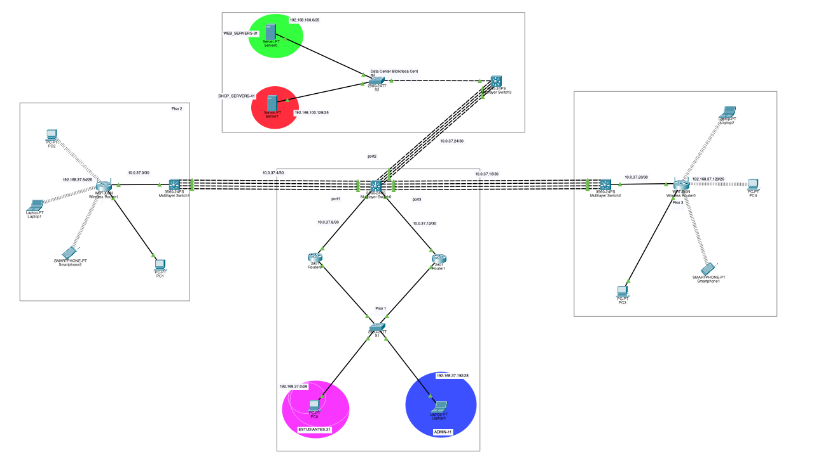

# Practica 2

## GRUPO 37

| Nombre                                 | Carnet      |
|----------------------------------------|-------------|
| Alejandro René Caballeros González     | 201903549   |
| Raudy David Cabrera Contreras	         | 201901973   |
| Christtopher Jose Chitay Coutino       | 201113851   |


## Objetivos

- 

## Topologia



## Configuraciones

### VLANs
37 = 3+7= 10 = 1+0 = 1

Calculo de No. VLAN: 
ADMIN – 10 + 1 = 11
ESTUDIANTES – 20 + 1 = 21
WEB_SERVERS – 30 + 1 = 31
DHCP_SERVERS – 40 + 1 = 41


| **VLAN** | **Color**         | **No.**       | 
|--------------------|--------------------|----------------------|
| ADMIN | **Azul**  | 11    | 
| ESTUDIANTES | **Rosado** | 21   | 
|  WEB_SERVERS | **Verde** | 31    |
| DHCP_SERVERS | **Naranja** | 41    |


### Configuracion de Vlans
 
### Switch0
```
enable
configure terminal
vlan 11
name ADMIN
vlan 21
name ESTUDIANTES
exit

interface fa0/1
switchport mode access
switchport access vlan 11
no shutdown
exit

interface fa0/2 
switchport mode access
switchport access vlan 21
no shutdown
exit

interface range fa0/3-4  
switchport mode trunk
switchport trunk allowed vlan all  
no shutdown
exit

end
wr
```

### Switch3
```
enable
configure terminal
vlan 31
name WEB_SERVERS
vlan 41
name DHCP_SERVERS
exit

interface fa0/1
switchport mode access
switchport access vlan 31
no shutdown
exit

interface fa0/2 
switchport mode access
switchport access vlan 41
no shutdown
exit

interface fa0/3
switchport mode trunk
switchport trunk allowed vlan all  
no shutdown
exit

end
wr
```