# Practica 2
---
## GRUPO 37


| Nombre                                 | Carnet      |
|----------------------------------------|-------------|
| Alejandro René Caballeros González     | 201903549   |
| Raudy David Cabrera Contreras	         | 201901973   |
| Christtopher Jose Chitay Coutino       | 201113851   |

## Introduccion
---
<div align="justify">
La presente práctica tiene como objetivo diseñar, implementar y documentar una red estructurada para la Facultad de Ingeniería de la Universidad de San Carlos de Guatemala, tomando como caso de estudio el edificio de la biblioteca. Dicha red busca atender el crecimiento en la demanda de servicios digitales por parte de los estudiantes, así como garantizar rendimiento, escalabilidad y disponibilidad de los servicios de red.

Durante el desarrollo de esta práctica, se implementaron conceptos avanzados de redes tales como segmentación por VLANs, enrutamiento dinámico con EIGRP, conmutación por enlaces agregados (LACP), alta disponibilidad mediante VRRP/HSRP, asignación dinámica de direcciones con DHCP, y resolución de nombres con DNS. Además, se configuraron redes inalámbricas diferenciadas por piso, con políticas de seguridad y visibilidad específicas.

La implementación se realizó en el entorno de simulación Cisco Packet Tracer, y cada componente fue configurado utilizando exclusivamente la interfaz de línea de comandos (CLI). Este documento presenta la topología propuesta, la lógica de diseño, los comandos utilizados y las pruebas realizadas para validar el correcto funcionamiento de cada componente de la red.
</div>


## Objetivos

---

* Implementar una red de alto rendimiento y escalabilidad para la biblioteca de la Facultad de Ingeniería de la USAC.

* Configurar VLANs para segmentar el tráfico y mejorar la seguridad de la red.

* Realizar el diseño y la asignación de subredes utilizando VLSM y FLSM.

* Configurar y verificar el funcionamiento del protocolo DHCP para asignación dinámica de direcciones IP.

* Implementar el protocolo DNS para resolución de nombres y publicación de un sitio web interno.

* Establecer comunicación entre dispositivos mediante el protocolo de enrutamiento EIGRP.

* Utilizar LACP para consolidar enlaces físicos y aumentar el ancho de banda entre edificios.

* Implementar el protocolo VRRP (HSRP en Cisco) para alta disponibilidad en las puertas de enlace de red.

* Configurar redes inalámbricas seguras y diferenciadas por piso, aplicando distintos niveles de visibilidad y acceso.

* Documentar de forma clara las configuraciones realizadas mediante un manual técnico en formato Markdown. 

## Topologia
--- 


## Configuraciones

---

### VLANs

<div align="justify">

Para mejorar la segmentación del tráfico y garantizar mayor seguridad, eficiencia y control dentro de la red, se han creado VLANs lógicas que agrupan dispositivos por función o ubicación. Esta separación permite aislar dominios de broadcast, facilitar la administración de red y aplicar políticas específicas por grupo de usuarios.

</div>

<p align="center">37 = 3+7= 10 = 1+0 = 1</p>

**Calculo de No. VLAN**: 

<p align="center">ADMIN – 10 + 1 = 11 </p>
<p align="center">ESTUDIANTES – 20 + 1 = 21</p>
<p align="center">WEB_SERVERS – 30 + 1 = 31</p>
<p align="center">DHCP_SERVERS – 40 + 1 = 41</p>

***Configuracion Final***:
| **VLAN** | **Color**         | **No.**       | 
|--------------------|--------------------|----------------------|
| ADMIN | **Azul**  | 11    | 
| ESTUDIANTES | **Rosado** | 21   | 
|  WEB_SERVERS | **Verde** | 31    |
| DHCP_SERVERS | **Naranja** | 41    |


### Configuracion de Vlans
 
### S1
```
enable
configure terminal
vlan 11
name ADMIN
vlan 21
name ESTUDIANTES
exit

interface fa0/2
switchport mode access
switchport access vlan 11
no shutdown
exit

interface fa0/1 
switchport mode access
switchport access vlan 21
no shutdown
exit

interface range fa0/3-4  
switchport mode trunk
switchport trunk allowed vlan all  
no shutdown
exit

end
wr
```

### S2
```
enable
configure terminal
vlan 31
name WEB_SERVERS
vlan 41
name DHCP_SERVERS
exit

interface fa0/2
switchport mode access
switchport access vlan 31
no shutdown
exit

interface fa0/3 
switchport mode access
switchport access vlan 41
no shutdown
exit

interface fa0/1
switchport mode trunk
switchport trunk allowed vlan all  
no shutdown
exit

end
wr
```

## Subnetting

---

## 192.168.37.0/24 Network Segmentation

| **Subnet**          | **Subnet Mask**       | **Usable IPs**            | **Hosts**         |
|---------------------|-----------------------|---------------------------|------------------------------|
| **192.168.37.0/26** | 255.255.255.192       | 192.168.37.1 - 192.168.37.62   | **62**      |
| **192.168.37.64/26**| 255.255.255.192       | 192.168.37.65 - 192.168.37.126 | **62**             |
| **192.168.37.128/26**|255.255.255.192       |192.168.37.129 - 192.168.37.190 | **62**             |
| **192.168.37.192/28**|255.255.255.240      |192.168.37.193 - 192.168.37.206 | **14**   |


## 192.168.100.0/24 Network Segmentation
| **Subnet**            | **Subnet Mask**       | **Usable IPs**            | **Hosts** |
|-----------------------|-----------------------|---------------------------|-----------|
| **192.168.100.0/25**  | 255.255.255.128       | 192.168.100.1 - 192.168.100.126   | **126**  |
| **192.168.100.128/25**| 255.255.255.128       | 192.168.100.129 - 192.168.100.254 | **126**  |

## 10.0.37.0/24 Network Segmentation
| **Subnet**        | **Subnet Mask**       | **Usable IPs**      | **Hosts** |
|--------------------|----------------------|---------------------|-----------|
| **10.0.37.0/30**  | 255.255.255.252      | 10.0.37.1 - 10.0.37.2    | **2**     |
| **10.0.37.4/30**  | 255.255.255.252      | 10.0.37.5 - 10.0.37.6    | **2**     | 
| **10.0.37.8/30**  | 255.255.255.252      | 10.0.37.9 - 10.0.37.10   | **2**     |
| **10.0.37.12/30** | 255.255.255.252      | 10.0.37.13 - 10.0.37.14  | **2**     |
| **10.0.37.16/30** | 255.255.255.252      | 10.0.37.17 - 10.0.37.18  | **2**     |
| **10.0.37.20/30** | 255.255.255.252      | 10.0.37.21 - 10.0.37.22  | **2**     |
| **10.0.37.24/30** | 255.255.255.252      | 10.0.37.25 - 10.0.37.26  | **2**     |


## Configuración de LACP entre edificios
---

<div align="justify">

Para garantizar una comunicación robusta, con mayor ancho de banda y tolerancia a fallos entre los distintos edificios de la Facultad de Ingeniería, se implementó LACP (Link Aggregation Control Protocol) mediante la tecnología EtherChannel.

Este protocolo permite agrupar múltiples enlaces físicos en un único canal lógico, aumentando el rendimiento y la disponibilidad. En caso de que uno de los enlaces falle, el tráfico continuará fluyendo a través de los demás sin interrumpir la conexión entre edificios.

</div>

***Características de la implementación***

* Se implementa EtherChannel con LACP en modo activo
* El Port-Channel se configura como trunk para transportar VLAN
* Se utilizan cuatro interfaces físicas por enlace entre switches.
* Se configura LACP en modo activo en ambos extremos.
* Se crea un canal lógico (Port-Channel) configurado como trunk, permitiendo el transporte de múltiples VLANs sobre un único enlace.
* Las VLANs permitidas en cada Port-Channel corresponden únicamente a las necesarias para el tráfico entre los edificios conectados.

```
enable
configure terminal
```

### Configuración en Switch 1

***Crear EtherChannel con LACP en los puertos físicos***
```
interface range fa0/1 - 4  
channel-group 1 mode active  # Habilita LACP en modo activo
exit

! Configurar Port-Channel como trunk
interface Port-channel1
 switchport trunk encapsulation dot1q  # Define el encapsulado (si es necesario)
 switchport mode trunk  # Configura el enlace como trunk
 switchport trunk allowed vlan 11,21  # Permite solo las VLANs necesarias
 no shutdown  # Asegura que la interfaz esté activa
exit
```


### Configuración en Switch 2

```
! Crear EtherChannel con LACP en los puertos físicos
interface range fa0/11 - 14  
 channel-group 1 mode active  # Habilita LACP en modo activo
exit

! Configurar Port-Channel como trunk
interface Port-channel1
 switchport trunk encapsulation dot1q  # Define el encapsulado (si es necesario)
 switchport mode trunk  # Configura el enlace como trunk
 switchport trunk allowed vlan 31,41  # Permite solo las VLANs necesarias
 no shutdown  # Asegura que la interfaz esté activa
exit

! --------------------------
! Guardar configuración
! --------------------------
end
wr

```

switch central (12)
```
enable
conf term
interface range fa0/1-4
channel-protocol lacp
exit

interface range fa0/11-14
channel-protocol lacp
exit

interface range fa0/21-24
channel-protocol lacp

end 

wr
```

## Enrutamiento Dinámico con EIGRP
--- 
<div align="justify">
Para lograr la conectividad entre las distintas subredes de la red de la biblioteca de ingeniería y la biblioteca central, se implementó el protocolo de enrutamiento dinámico EIGRP (Enhanced Interior Gateway Routing Protocol), el cual es utilizado en esta práctica debido a que el grupo 37 es impar.

EIGRP permite a los dispositivos de red intercambiar rutas de forma automática y eficiente, adaptándose dinámicamente a cambios en la topología. Este protocolo fue elegido por su rápida convergencia, bajo uso de ancho de banda y soporte para VLSM (Variable Length Subnet Masking), lo cual lo hace ideal para entornos escalables como el de esta práctica.


***Su implementación proporciona ventajas como***:

* Rápida convergencia ante cambios en la topología.
* Bajo uso de ancho de banda al enviar actualizaciones parciales.
* Soporte para VLSM (Variable Length Subnet Masking).
* Métricas compuestas (ancho de banda, retardo, carga, confiabilidad).


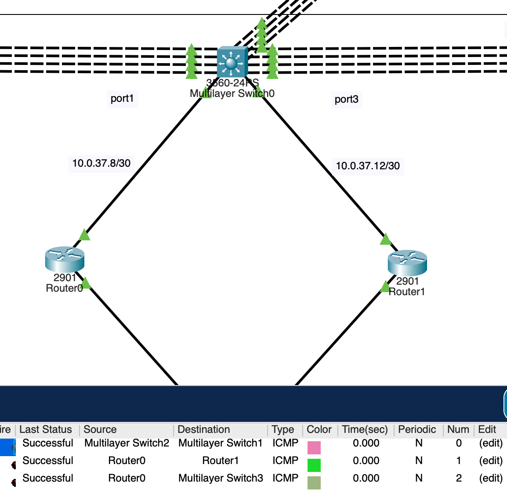

</div>

#### Multilyer SW1

```
enable
configure terminal
ip routing
interface port-channel 1
no switchport
ip address 10.0.37.5 255.255.255.252
no shutdown
exit

interface fa0/11
no switchport
ip address 10.0.37.1 255.255.255.252
exit

router eigrp 100
network 10.0.37.0 0.0.0.3
network 10.0.37.4 0.0.0.3
no auto-summary
exit

end 
wr
```

#### Multilyer SW0

```
enable
configure terminal
ip routing
interface port-channel 1
no switchport
ip address 10.0.37.6 255.255.255.252
no shutdown
exit

interface port-channel 2
no switchport
ip address 10.0.37.25 255.255.255.252
no shutdown
exit

interface port-channel 3
no switchport
ip address 10.0.37.17 255.255.255.252
no shutdown
exit

interface gig0/1
no switchport
ip address 10.0.37.9 255.255.255.252
exit

interface gig0/2
no switchport
ip address 10.0.37.13 255.255.255.252
exit

router eigrp 100
network 10.0.37.4 0.0.0.3
network 10.0.37.8 0.0.0.3
network 10.0.37.12 0.0.0.3
network 10.0.37.16 0.0.0.3
network 10.0.37.24 0.0.0.3
no auto-summary
exit

end 
wr
```

#### Multilyer SW2

```
enable
configure terminal
ip routing
interface port-channel 1
no switchport
ip address 10.0.37.18 255.255.255.252
no shutdown
exit

interface fa0/11
no switchport
ip address 10.0.37.21 255.255.255.252
exit

router eigrp 100
network 10.0.37.16 0.0.0.3
network 10.0.37.20 0.0.0.3
no auto-summary
exit

end 
wr
```

#### Multilyer SW3

```
enable
configure terminal
ip routing
interface port-channel 1
no switchport
ip address 10.0.37.26 255.255.255.252
no shutdown
exit

interface fa0/11
no switchport
no shutdown
exit

interface vlan 31
ip address 192.168.100.1 255.255.255.128
no shutdown
exit

interface vlan 41
ip address 192.168.100.129 255.255.255.128
no shutdown
exit

router eigrp 100
network 10.0.37.24 0.0.0.3
network 192.168.100.0 0.0.0.127
network 192.168.100.128 0.0.0.127
no auto-summary
exit

end 
wr
```

#### Router0

```
enable
configure terminal

interface gig0/1
ip address 10.0.37.10 255.255.255.252
no shutdown
exit

interface gigabitEthernet 0/0
no shutdown
exit

interface gigabitEthernet 0/0.21
encapsulation dot1Q 21
ip address 192.168.37.1 255.255.255.192
exit

interface gigabitEthernet 0/0.11
encapsulation dot1Q 11
ip address 192.168.37.193 255.255.255.240
exit

router eigrp 100
network 10.0.37.8 0.0.0.3
network 192.168.37.0 0.0.0.63
network 192.168.37.192 0.0.0.15
no auto-summary
exit

end 
wr
```

#### Router1
```
enable
configure terminal

interface gig0/1
ip address 10.0.37.14 255.255.255.252
no shutdown
exit

interface gigabitEthernet 0/0
no shutdown
exit

interface gigabitEthernet 0/0.21
encapsulation dot1Q 21
ip address 192.168.37.2 255.255.255.192
exit

interface gigabitEthernet 0/0.11
encapsulation dot1Q 11
ip address 192.168.37.194 255.255.255.240
exit

router eigrp 100
network 10.0.37.12 0.0.0.3
network 192.168.37.0 0.0.0.63
network 192.168.37.192 0.0.0.15
no auto-summary
exit

end 
wr
```


## VRRP (HRRP en Packet Tracer - standby)
---
<div align="justify">
Para garantizar alta disponibilidad en la red cableada del primer piso, se implementó el protocolo VRRP (Virtual Router Redundancy Protocol). En el entorno de Cisco Packet Tracer, este protocolo se simula mediante la configuración de HSRP (Hot Standby Router Protocol).

VRRP/HSRP permite definir una puerta de enlace virtual compartida entre dos routers físicos. De esta forma, si el router principal (activo) llegara a fallar, el router secundario (en espera) asume el rol de gateway de forma automática, evitando la pérdida de conectividad para los dispositivos finales.

</div>

### Router0

```
enable
configure terminal

! Configuración para la VLAN ESTUDIANTES-21
interface GigabitEthernet0/0.21
standby 21 ip 192.168.37.3
standby 21 priority 110
standby 21 preempt
exit

! Configuración para la VLAN ADMIN-11
interface GigabitEthernet0/0.11
standby 11 ip 192.168.37.195
standby 11 priority 90
standby 11 preempt
exit

end
wr

show standby brief

```
### Router1

```
enable
configure terminal

! Configuración para la VLAN ESTUDIANTES-21
interface GigabitEthernet0/0.21
standby 21 ip 192.168.37.3
standby 21 priority 90
standby 21 preempt
exit

! Configuración para la VLAN ADMIN-11
interface GigabitEthernet0/0.11
standby 11 ip 192.168.37.195
standby 11 priority 110
standby 11 preempt
exit

end
wr

show standby brief

```


## Configuracion Inalambrica
---
<div align="justify">
Como parte del rediseño de la infraestructura de red en la biblioteca de ingeniería, se implementaron redes inalámbricas (WiFi) en los pisos 2 y 3. Estas redes brindan conectividad sin cables a estudiantes y personal que accede a la red institucional desde dispositivos móviles o portátiles.

Cada piso cuenta con una red inalámbrica independiente, configurada con diferentes políticas de visibilidad y acceso para representar distintos entornos de uso:

***Configuración Inalámbrica (Grupo 37)***


***Piso 2***:


La red inalámbrica del Piso 2, identificada con el SSID PISO_2_G37, está configurada con el broadcast desactivado, lo que impide que la red sea visible en la lista de redes disponibles. Esta configuración busca incrementar la seguridad al requerir que los usuarios conozcan y configuren manualmente el nombre del SSID y la contraseña de acceso (G37_PISO2). Se emplea el protocolo de seguridad WPA2 Personal con cifrado AES, brindando una comunicación protegida entre el router y los dispositivos. Esta estrategia simula un entorno de red restringido o interno, en donde el acceso debe estar limitado únicamente a usuarios autorizados con información previa.


| Parámetro             | Piso 1           |
|------------------------|-----------------|
| **SSID**               | PISO_2_G37      |
| **Broadcast**          | No              |
| **Seguridad**          | WPA2 Personal   |
| **Contraseña RED**     | G37_PISO2       |
| **Contraseña Router**  | Grupo37_P2      |


***Piso 3***:

En contraste, la red del Piso 3, con el SSID PISO_3_G37, tiene habilitado el broadcast, lo que permite que sea detectada automáticamente por los dispositivos inalámbricos en las cercanías. Esto facilita la conexión de los usuarios al no requerir la configuración manual del nombre de la red. Al igual que en el Piso 2, se utiliza WPA2 Personal como mecanismo de seguridad con cifrado AES y una clave de acceso personalizada (G37_PISO3). Esta configuración representa un entorno de red más accesible, adecuado para áreas comunes o espacios en los que se espera mayor conectividad sin sacrificar la seguridad de los datos transmitidos.
</div>


| Parámetro             | Piso 3           |
|------------------------|-----------------|
| **SSID**               | PISO_3_G37      |
| **Broadcast**          | Si              |
| **Seguridad**          | WPA2 Personal   |
| **Contraseña RED**     | G37_PISO3       |
| **Contraseña Router**  | Grupo37_P3      |


### DHCP para Rowters WiFi

| Parámetro                | Router Piso 2                  | Router Piso 3                  |
|--------------------------|--------------------------------|--------------------------------|
| **Red/Subred**           | 192.168.37.64/26               | 192.168.37.128/26              |
| **Dirección del Router** | 192.168.37.65                  | 192.168.37.129                 |
| **Máscara de Subred**    | 255.255.255.192                | 255.255.255.192                |
| **Rango DHCP**           | 192.168.37.66 – 192.168.37.126 | 192.168.37.130 – 192.168.37.190|
| **IP de Broadcast**      | 192.168.37.127                 | 192.168.37.191                 |
| **DNS Server**           | 192.168.100.2                  | 192.168.100.2                  |
| **Gateway (Default)**    | 192.168.37.65                  | 192.168.37.129                 |


## Coniguracion DHCP
---
<div align="justify">
El protocolo DHCP (Dynamic Host Configuration Protocol) fue implementado para automatizar la asignación de direcciones IP a todos los dispositivos finales conectados en la red, tanto cableados como inalámbricos. Esta configuración facilita la administración de red, reduce errores de configuración manual y asegura que cada dispositivo reciba los parámetros adecuados de red.

***Elementos clave de la configuración***:
* Cada pool de direcciones define el rango, gateway y DNS específico para su VLAN o piso.
* El comando ip helper-address permite reenviar solicitudes DHCP de subredes remotas hacia el servidor central.
* Las interfaces trunk y VLANs se habilitan para permitir el paso de tráfico entre switches, routers y el servidor.


</div>


### SW3
```
!Switch 3
enable
configure terminal
vlan 31
name WEB_SERVERS
vlan 41
name DHCP_SERVERS
exit

interface fa0/11
switchport
switchport mode trunk
switchport trunk allowed vlan all

end
wr

```
### SW2
```
!S2
enable
configure terminal
interface fa0/1
switchport trunk allowed vlan all
end
wr

```

### Server DHCP


#### IP
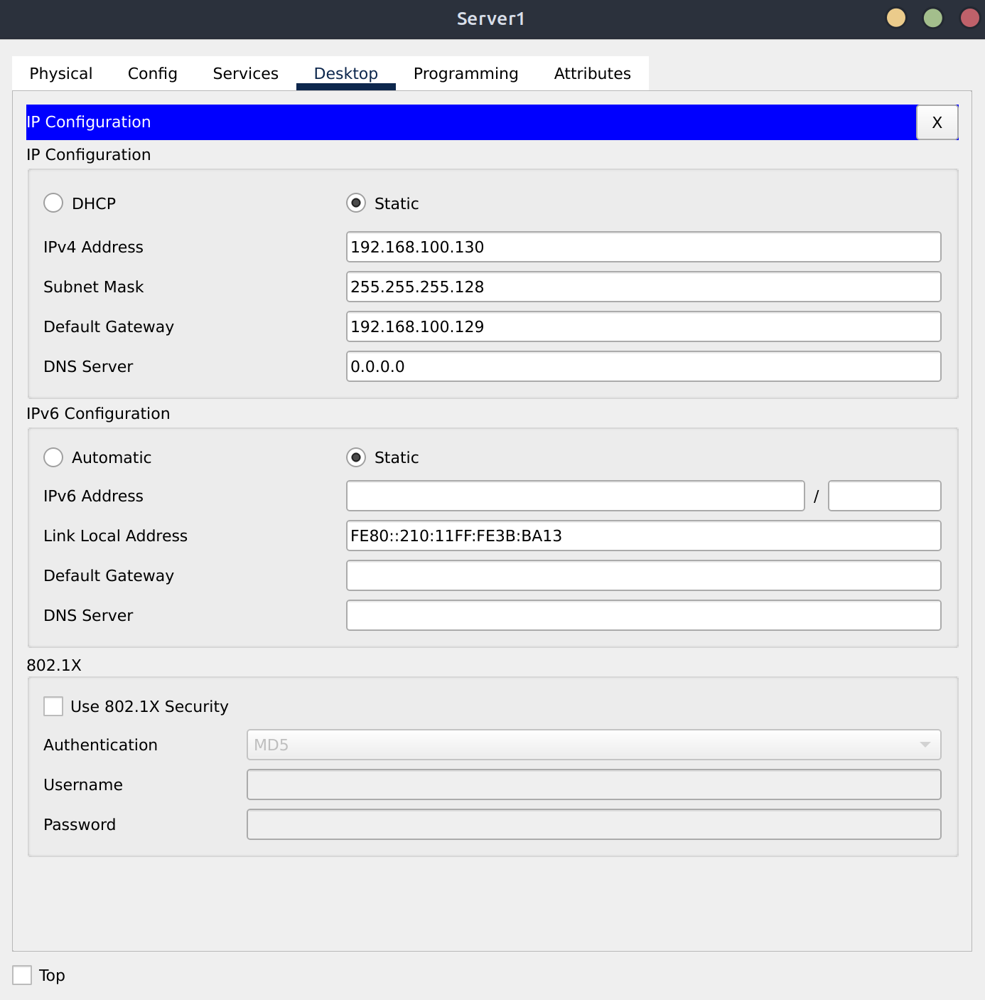

### Pools

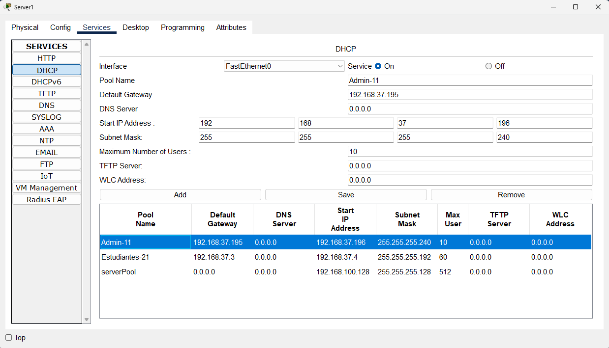
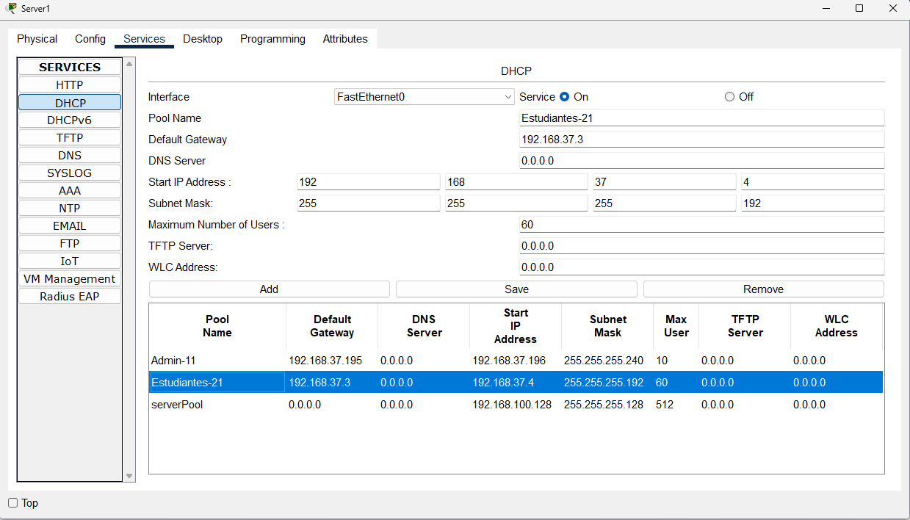

### Router0
```
! Helper Address
enable
configure terminal
interface GigabitEthernet0/0.11
ip helper-address 192.168.100.130
exit
interface GigabitEthernet0/0.21
ip helper-address 192.168.100.130
exit
end
wr

```

### Router1
```
! Helper Address
enable
configure terminal
interface GigabitEthernet0/0.11
ip helper-address 192.168.100.130
exit
interface GigabitEthernet0/0.21
ip helper-address 192.168.100.130
exit
end
wr

```

### PC's
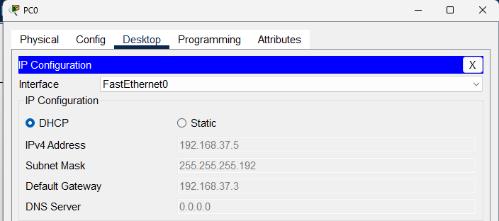
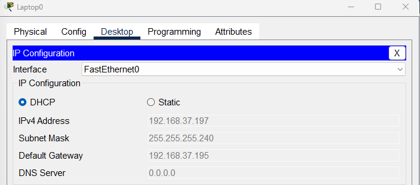


## Configuracion DNS
---
<div align="justify">
El servicio DNS (Domain Name System) fue implementado para permitir la resolución de nombres dentro de la red, facilitando el acceso a servicios web mediante nombres de dominio en lugar de direcciones IP. Esta configuración mejora la usabilidad de la red y simula un entorno real en el que los usuarios acceden a recursos utilizando URLs.
</div>

1. ***Asignar direccion IP estatica al Servidor***:
    * IP: 192.168.100.2
    * Subnet mask: 255.255.255.128
    * Default Gateway: Dirección IP del router o switch multilayer que conecta al servidor.
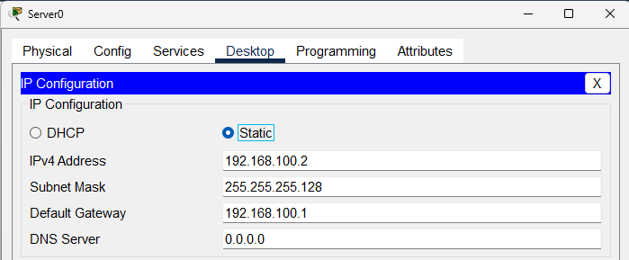


2. ***Activar el servicio HTTP***:
    * En services seleccionar HTTP y asegurarse que el servicio esta encendido

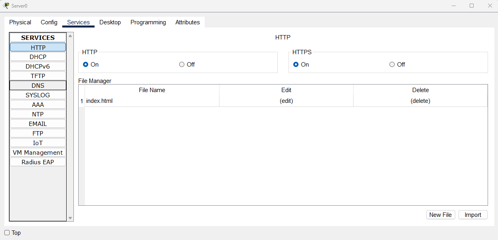

3. ***Editar el contenido de la pagina web y darle save***:

```html
<!DOCTYPE html>
<html>
<head>
  <title>Grupo 37</title>
</head>
<body>
  <h1>Bienvenidos a la Práctica 2</h1>
  <p>Integrantes del Grupo 37:</p>
  <ul>
    <li> Alejandro Rene Caballeros Gonzales - 201903549</li>
    <li> Christtopher Jose Chitay Coutino - 201113851</li>
    <li> Raudy David Cabrera Contreras - 201901973</li>
  </ul>
</body>
</html>
```
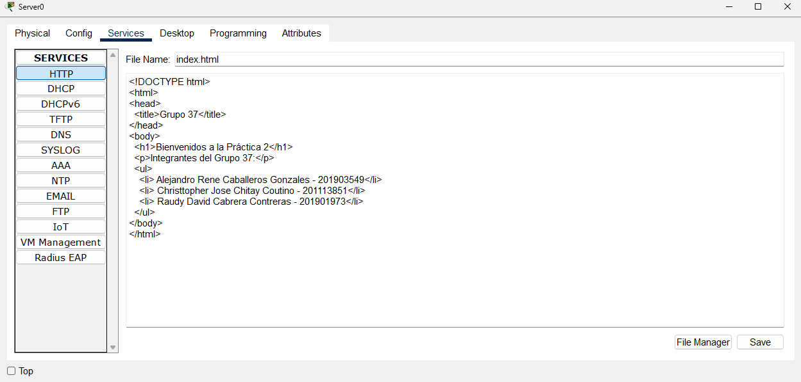

### Configurar el Servidor DNS (ServerDHCP o ServerDNS)

1. Ir Services > DNS y encender el servicio ON

2. En el campo de configuracion de dominio agregar:
    * Name: www.practica2_Grupo37.com
    * Address: Dirección IP del ServerWeb, por ejemplo 192.168.100.2
    * Presionar Add.

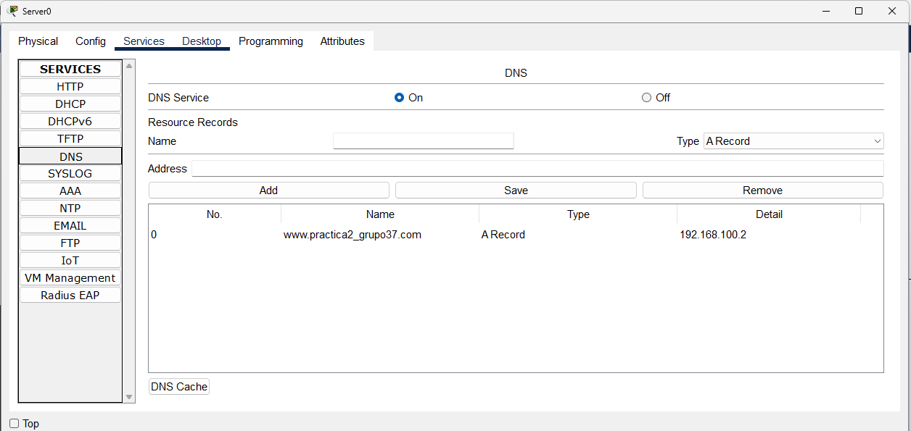


### Actualizar los Pool del Server DHCP en la propiedad DNS

Irse al Servidor DHCP y actuacilar la el dns

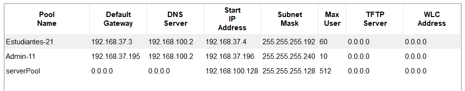

### Actualizar DNS de Wirless Router 1

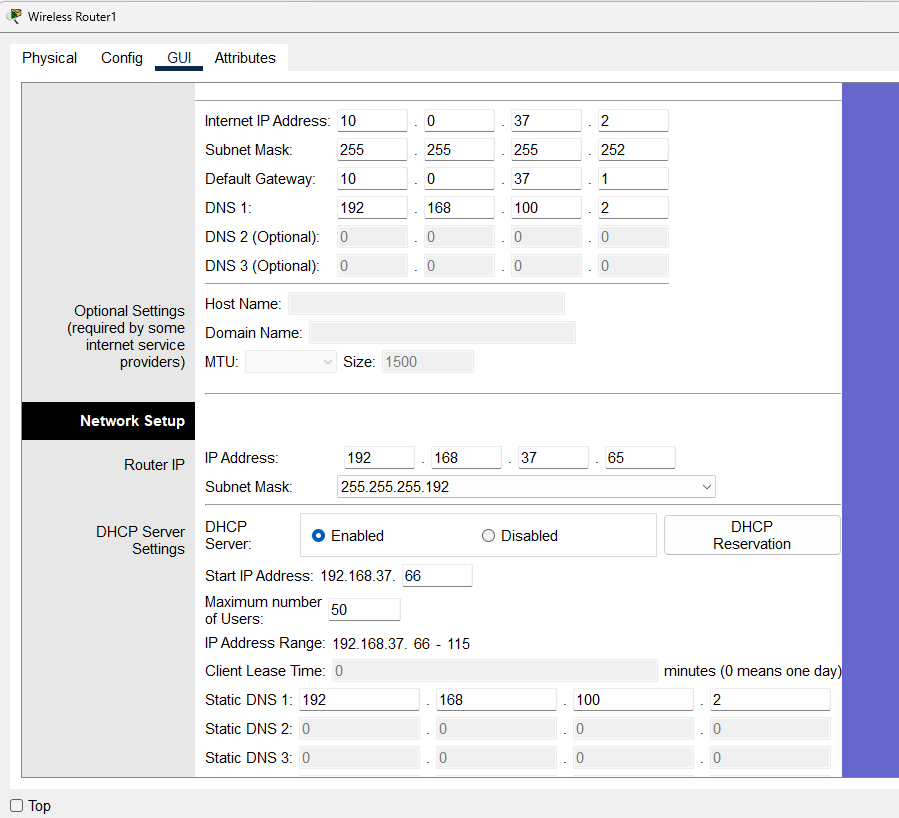

### Actualizar DNS de Wirless Router 0

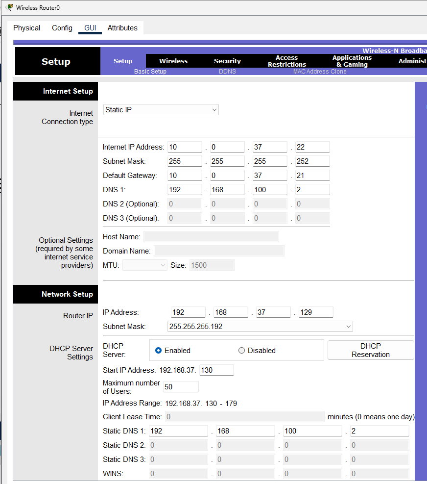

### Actualizar DNS de todas las PC

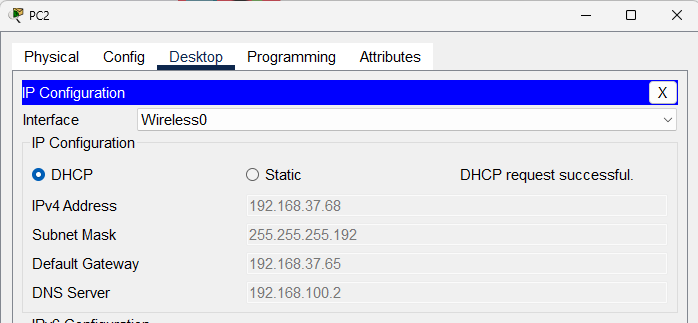

### Prueba DNS

Ingresar a PC > Desktop > Web Browser

Y poner esta URL
```
http://www.practica2_Grupo37.com
```
Darle "Go"

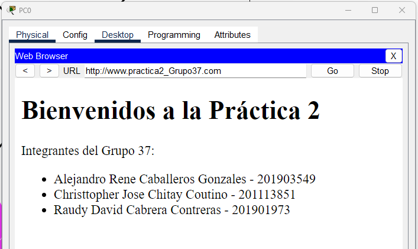