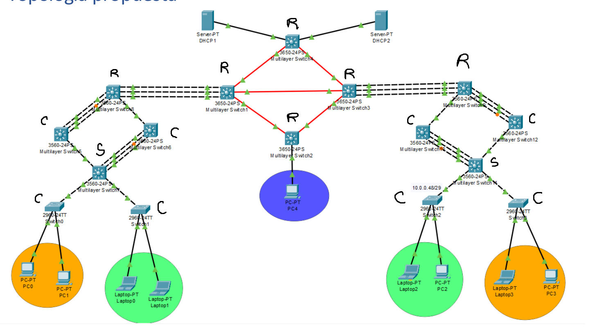

# Proyecto 1

## GRUPO 37

| Nombre                                 | Carnet      |
|----------------------------------------|-------------|
| Alejandro René Caballeros González     | 201903549   |
| Raudy David Cabrera Contreras	         | 201901973   |
| Christtopher Jose Chitay Coutino       | 201113851   |


## Objetivos

- Realizar las configuraciones de switches multicapa y capa 2.
- Implementar los protocolos de capa 3: RIP, OSPF, EIGRP y BGP.
- Aplicar los conocimientos de redes MAN, LAN y WAN.
- Aplicar los conocimientos de LACP.y PAGP
- Implementar ACL’s.
- Familiarizarse con las configuraciones de DHCP y sus conceptos.

## Topologia


## Configuraciones

### Switches Capa 2

Para determinar vtp primero hay que identificar quienes actuaran como capa 2

S = Server vtp 
C = Cliente vtp
R = router (switch actua como router no aplicará vtp)



### Switch servidor - S
```
enable 
configure terminal 
vtp domain g37 
vtp mode server 
vtp password cisco123 
end
wr
show vtp status
```

### Switches clientes - C
```
enable 
configure terminal 
vtp domain g37 
vtp mode client 
vtp password cisco123 
end
wr
show vtp status
```

### Switches servidor - S con STP (rapid-pvst)
```
enable
configure terminal
spanning-tree mode rapid-pvst
end
wr
show spanning-tree
```

### Switches clientes - C con STP (rapid-pvst)
```
enable
configure terminal
spanning-tree mode rapid-pvst
end
wr
show spanning-tree
```


### Configuracion de Vlans S1
enable
configure terminal
vlan 10
 name 37_Naranja_EdificioIZQ
vlan 20
 name 37_Verde_EdificioIZQ
exit


### Configuracion de puertos trunkales

enable
configure terminal
interface range fa0/1-4
switchport trunk encapsulation dot1q
switchport mode trunk
switchport trunk allowed vlan all
end 
write memory

### Configuracion R4

configure terminal
vlan 30
name 37_Admin_Central
exit

interface GigabitEthernet1/0/3
switchport mode access
switchport access vlan 30
no shutdown
exit

interface range GigabitEthernet1/1/1 - 2  
switchport mode trunk
switchport trunk allowed vlan all  
no shutdown
exit


### Configuracion R3
enable
configure terminal
interface range GigabitEthernet1/0/1 - 2  
switchport mode trunk
switchport trunk allowed vlan all  
no shutdown
exit

interface range GigabitEthernet1/1/1 - 2
switchport mode trunk
switchport trunk allowed vlan all  
no shutdown
exit


## LACP Lado Izquierdo

### S1

enable
configure terminal
interface range Fa0/1-3
channel-protocol lacp
channel-group 1 mode active
no shutdown
end 
wr

show etherchannel
show etherchannel port-channel
show interfaces port-channel 1

### C1

enable
configure terminal
interface range Fa0/1-3
channel-protocol lacp
channel-group 1 mode passive
no shutdown
end 
wr

show etherchannel
show etherchannel port-channel
show interfaces port-channel 1


### C2

enable
configure terminal
interface range Fa0/1-3
channel-protocol lacp
channel-group 1 mode active
no shutdown
end 
wr

show etherchannel
show etherchannel port-channel
show interfaces port-channel 1

### R5

```
enable
configure terminal
interface range Fa0/1-3
channel-protocol lacp
channel-group 1 mode passive
no shutdown
end 
wr

show etherchannel
show etherchannel port-channel
show interfaces port-channel 1

enable
configure terminal
interface range Fa0/11-13
channel-protocol lacp
channel-group 2 mode active
no shutdown
end 
wr

show etherchannel
show etherchannel port-channel
show interfaces port-channel 2

```

### R2

```
enable
configure terminal
interface range GigabitEthernet1/0/1-3 
channel-protocol lacp
channel-group 1 mode passive
no shutdown
end 
wr

show etherchannel
show etherchannel port-channel
show interfaces port-channel 1
```


## PAGP Lado Derecho

# Switch R3
interface range GigabitEthernet1/0/1-3
 channel-group 1 mode desirable

# Switch R6
interface range FastEthernet0/11-13
 channel-group 1 mode auto

interface range FastEthernet0/1-3
 channel-group 3 mode desirable

# Switch C5
interface range FastEthernet0/1-3
 channel-group 3 mode auto

# Switch C6
interface range FastEthernet0/1-3
 channel-group 2 mode desirable

# Switch S2
interface range FastEthernet0/1-3
 channel-group 2 mode auto


## Verificacion de la configuracion 

# Ver el estado de los EtherChannels configurados
show etherchannel summary

# Ver detalles de una interfaz agregada a un canal
show interfaces port-channel <ID>

# Mostrar información sobre los vecinos PagP
show pagp neighbor

# Ver los puertos configurados en un EtherChannel
show etherchannel port-channel

# Revisar la configuración aplicada a las interfaces
show running-config | section interface

