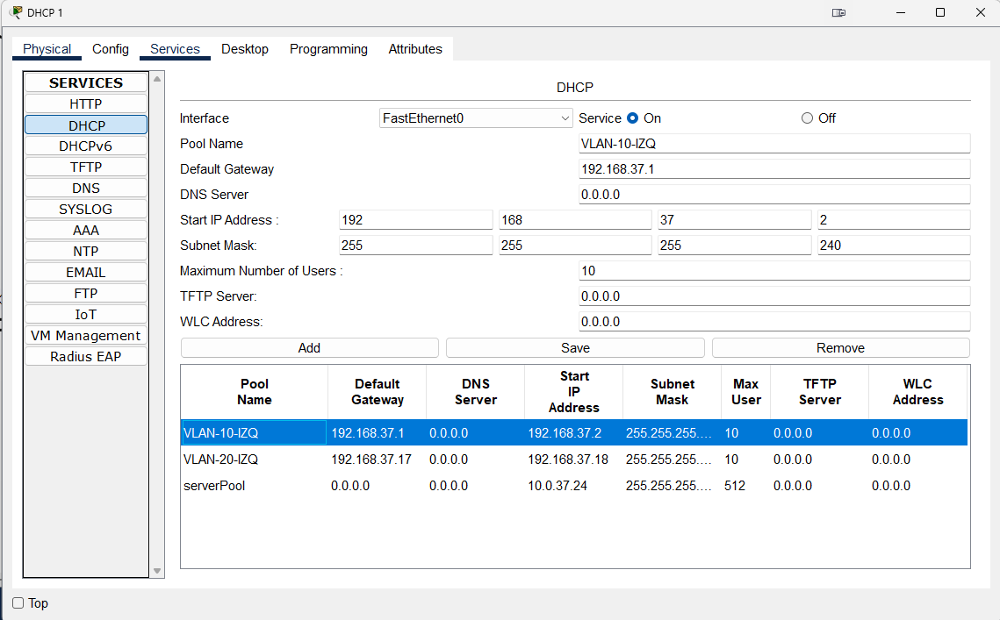
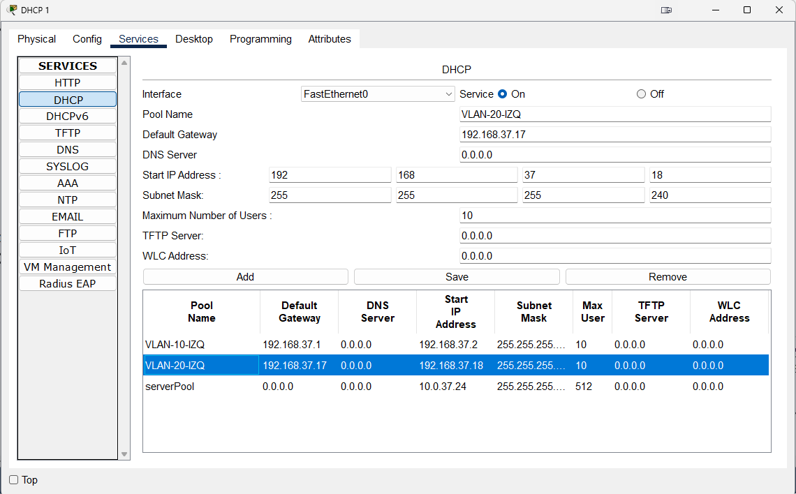
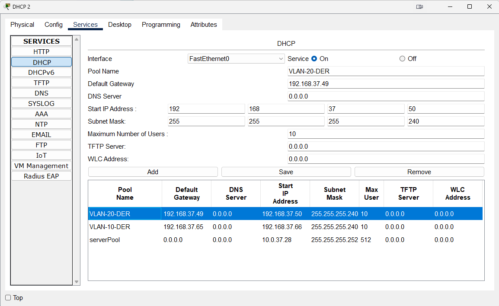
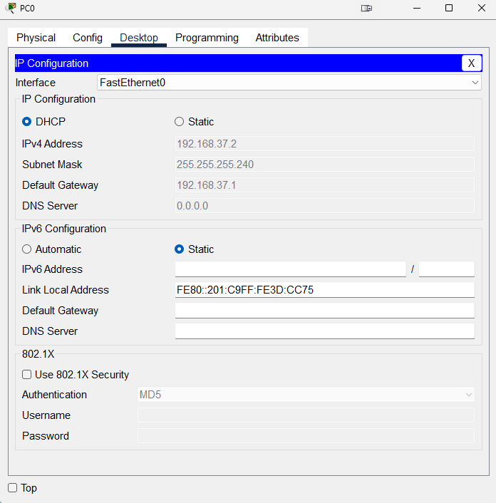

# Proyecto 1

## GRUPO 37

| Nombre                                 | Carnet      |
|----------------------------------------|-------------|
| Alejandro René Caballeros González     | 201903549   |
| Raudy David Cabrera Contreras	         | 201901973   |
| Christtopher Jose Chitay Coutino       | 201113851   |


## Objetivos

- Realizar las configuraciones de switches multicapa y capa 2.
- Implementar los protocolos de capa 3: RIP, OSPF, EIGRP y BGP.
- Aplicar los conocimientos de redes MAN, LAN y WAN.
- Aplicar los conocimientos de LACP.y PAGP
- Implementar ACL’s.
- Familiarizarse con las configuraciones de DHCP y sus conceptos.

## Topologia


## Configuraciones

### Switches Capa 2

Para determinar vtp primero hay que identificar quienes actuaran como capa 2

S = Server vtp 
C = Cliente vtp
R = router (switch actua como router no aplicará vtp)


### Switch servidor - S
```
enable 
configure terminal 
vtp version 2
vtp domain g37 
vtp mode server 
vtp password cisco123 
end
wr
show vtp status
```

### Switches clientes - C
```
enable 
configure terminal 
vtp version 2
vtp domain g37 
vtp mode client 
vtp password cisco123 
end
wr
show vtp status
```

### Switches servidor - S con STP (rapid-pvst)
```
enable
configure terminal
spanning-tree mode rapid-pvst
end
wr
show spanning-tree
```

### Switches clientes - C con STP (rapid-pvst)
```
enable
configure terminal
spanning-tree mode rapid-pvst
end
wr
show spanning-tree
```


### Configuracion de Vlans S1
enable
configure terminal
vlan 10
 name 37_Naranja_EdificioIZQ
vlan 20
 name 37_Verde_EdificioIZQ
exit


### Configuracion de puertos trunkales

enable
configure terminal
interface range fa0/4-6
switchport mode trunk
switchport trunk allowed vlan 10,20
end 
write memory

### Configuracion R4

configure terminal
vlan 30
name 37_Admin_Central
exit

interface GigabitEthernet1/0/3
switchport mode access
switchport access vlan 30
no shutdown
exit

interface range GigabitEthernet1/1/1 - 2  
switchport mode trunk
switchport trunk allowed vlan all  
no shutdown
exit


### Configuracion R3
enable
configure terminal
interface range GigabitEthernet1/0/1 - 2  
switchport mode trunk
switchport trunk allowed vlan all  
no shutdown
exit

interface range GigabitEthernet1/1/1 - 2
switchport mode trunk
switchport trunk allowed vlan all  
no shutdown
exit


## LACP Lado Izquierdo

### S1

enable
configure terminal
interface range Fa0/1-3
channel-protocol lacp
channel-group 1 mode active
no shutdown
end 
wr

show etherchannel
show etherchannel port-channel
show interfaces port-channel 1

### C1

enable
configure terminal
interface range Fa0/1-3
channel-protocol lacp
channel-group 1 mode passive
no shutdown
end 
wr

show etherchannel
show etherchannel port-channel
show interfaces port-channel 1


### C2

enable
configure terminal
interface range Fa0/1-3
channel-protocol lacp
channel-group 1 mode active
no shutdown
end 
wr

show etherchannel
show etherchannel port-channel
show interfaces port-channel 1

### R5

```
enable
configure terminal
interface range Fa0/1-3
channel-protocol lacp
channel-group 1 mode passive
no shutdown
end 
wr

show etherchannel
show etherchannel port-channel
show interfaces port-channel 1

enable
configure terminal
interface range Fa0/11-13
channel-protocol lacp
channel-group 2 mode active
no shutdown
end 
wr

show etherchannel
show etherchannel port-channel
show interfaces port-channel 2

```

### R2

```
enable
configure terminal
interface range GigabitEthernet1/0/1-3 
channel-protocol lacp
channel-group 1 mode passive
no shutdown
end 
wr

show etherchannel
show etherchannel port-channel
show interfaces port-channel 1
```


## PAGP Lado Derecho

### Switch R3
interface range GigabitEthernet1/0/1-3
channel-protocol pagp
channel-group 1 mode desirable

### Switch R6
interface range FastEthernet0/11-13
channel-protocol pagp
channel-group 1 mode auto

interface range FastEthernet0/1-3
channel-protocol pagp
channel-group 3 mode desirable

### Switch C5
interface range FastEthernet0/1-3
channel-protocol pagp
channel-group 3 mode auto

### Switch C6
interface range FastEthernet0/1-3
channel-protocol pagp
channel-group 2 mode desirable

### Switch S2
interface range FastEthernet0/1-3
channel-protocol pagp
channel-group 2 mode auto


## Verificacion de la configuracion 

### Ver el estado de los EtherChannels configurados
show etherchannel summary

### Ver detalles de una interfaz agregada a un canal
show interfaces port-channel <ID>

### Mostrar información sobre los vecinos PagP
show pagp neighbor

### Ver los puertos configurados en un EtherChannel
show etherchannel port-channel

### Revisar la configuración aplicada a las interfaces
show running-config | section interface

# IP Address Allocation Table

## 10.0.37.0/24 Network Segmentation

| **Subnet**        | **Subnet Mask**       | **Usable IPs**           | **Assigned Devices** |
|-------------------|----------------------|--------------------------|----------------------|
| **10.0.37.0/30**  | 255.255.255.252       | 10.0.37.1 - 10.0.37.2    | **R5 - Port-Channel1** |
| **10.0.37.4/30**  | 255.255.255.252       | 10.0.37.5 - 10.0.37.6    | **R2 - Gi1/1/2 → R1 - Gi1/1/2** |
| **10.0.37.8/30**  | 255.255.255.252       | 10.0.37.9 - 10.0.37.10   | **R2 - Gi1/1/4 → R3 - Gi1/1/3** |
| **10.0.37.12/30** | 255.255.255.252       | 10.0.37.13 - 10.0.37.14  | **R2 - Gi1/1/3 → R4 - Gi1/1/1** |
| **10.0.37.16/30** | 255.255.255.252       | 10.0.37.17 - 10.0.37.18  | **R4 - Gi1/1/2 → R3 - Gi1/1/1** |
| **10.0.37.20/30** | 255.255.255.252       | 10.0.37.21 - 10.0.37.22  | **R1 - Gi1/1/1 → R3 - Gi1/1/2** |
| **10.0.37.24/30** | 255.255.255.252       | 10.0.37.25 - 10.0.37.26  | **Server1 - Fa0 → R1 - Gi1/0/1** |
| **10.0.37.28/30**	| 255.255.255.252	    |10.0.37.29 - 10.0.37.30   | **Server2 - Fa0 → R1 - Gi1/0/2** |
| **10.0.37.32/30** | 255.255.255.252       | 10.0.37.33 - 10.0.37.34  | **R3 - Port-Channel1 → R6 - Port-Channel1** |

---

## 192.168.37.0/24 Network Segmentation

| **VLAN** | **Subnet**         | **Subnet Mask**       | **Usable IPs**            | **Assigned Devices** |
|--------------------|--------------------|----------------------|---------------------------|----------------------|
| Naranja | **192.168.37.0/28**  | 255.255.255.240    | 192.168.37.1 - 192.168.37.14  | **R5 - VLAN 10** |
| Verde | **192.168.37.16/28** | 255.255.255.240    | 192.168.37.17 - 192.168.37.30 | **R5 - VLAN 20** |
|  ADMIN | **192.168.37.32/28** | 255.255.255.240    | 192.168.37.33 - 192.168.37.46 | **R4 - VLAN 30** |
| Verde | **192.168.37.48/28** | 255.255.255.240    | 192.168.37.49 - 192.168.37.62 | **R6 - VLAN 20** |
| Naranja | **192.168.37.64/28** | 255.255.255.240    | 192.168.37.65 - 192.168.37.78 | **R6 - VLAN 10** |


## Routing onc OSPF

### R5
enable
configure terminal
ip routing

interface vlan 10
ip address 192.168.37.1 255.255.255.240
no shutdown
exit
interface vlan 20
ip address 192.168.37.17 255.255.255.240
no shutdown
exit
interface port-channel 2
ip address 10.0.37.1 255.255.255.252
exit

router ospf 1
network 192.168.37.0 0.0.0.15 area 1
network 192.168.37.16 0.0.0.15 area 1
network 10.0.37.0 0.0.0.3 area 1
end
wr

### R1
enable
configure terminal
ip routing

interface GigabitEthernet1/0/1
ip address 10.0.37.26 255.255.255.252
exit
interface GigabitEthernet1/0/2
ip address 10.0.37.29 255.255.255.252
exit
interface GigabitEthernet1/1/1
ip address 10.0.37.21 255.255.255.252
exit
interface GigabitEthernet1/1/2
ip address 10.0.37.6 255.255.255.252
exit

router ospf 1
network 10.0.37.24 0.0.0.3 area 1
network 10.0.37.28 0.0.0.3 area 1
network 10.0.37.4 0.0.0.3 area 1
network 10.0.37.20 0.0.0.3 area 1
end
wr

### R2
enable
configure terminal
ip routing

interface port-channel 1
ip address 10.0.37.2 255.255.255.252
exit
interface GigabitEthernet1/1/2
ip address 10.0.37.5 255.255.255.252
exit
interface GigabitEthernet1/1/3
ip address 10.0.37.13 255.255.255.252
exit
interface GigabitEthernet1/1/4
ip address 10.0.37.9 255.255.255.252
exit


router ospf 1
network 10.0.37.0 0.0.0.3 area 1
network 10.0.37.4 0.0.0.3 area 1
network 10.0.37.8 0.0.0.3 area 1
network 10.0.37.12 0.0.0.3 area 1
end
wr

### R3
enable
configure terminal
ip routing

interface port-channel 1
ip address 10.0.37.33 255.255.255.252
exit
interface GigabitEthernet1/1/1
ip address 10.0.37.18 255.255.255.252
exit
interface GigabitEthernet1/1/2
ip address 10.0.37.22 255.255.255.252
exit
interface GigabitEthernet1/1/3
ip address 10.0.37.10 255.255.255.252
exit

router ospf 1
network 10.0.37.32 0.0.0.3 area 1
network 10.0.37.20 0.0.0.3 area 1
network 10.0.37.8 0.0.0.3 area 1
network 10.0.37.16 0.0.0.3 area 1
end
wr

### R4
enable
configure terminal
ip routing

interface vlan 30
ip address 192.168.37.33 255.255.255.240
no shutdown
exit
interface GigabitEthernet1/1/1
ip address 10.0.37.14 255.255.255.252
exit
interface GigabitEthernet1/1/2
ip address 10.0.37.17 255.255.255.252
exit

router ospf 1
network 192.168.37.32 0.0.0.15 area 1
network 10.0.37.12 0.0.0.3 area 1
network 10.0.37.16 0.0.0.3 area 1
end
wr

### R6
enable
configure terminal
ip routing

interface vlan 10
ip address 192.168.37.65 255.255.255.240
no shutdown
exit
interface vlan 20
ip address 192.168.37.49 255.255.255.240
no shutdown
exit
interface port-channel 1
ip address 10.0.37.34 255.255.255.252
exit

router ospf 1
network 192.168.37.48 0.0.0.15 area 1
network 192.168.37.64 0.0.0.15 area 1
network 10.0.37.32 0.0.0.3 area 1
end
wr

# DHCP

### DHCP 1



### DHCP 2



### R5
````
# Helper Address
enable
configure terminal
interface vlan 10
ip helper-address 10.0.37.25
exit
interface vlan 20
ip helper-address 10.0.37.25
exit
end
wr
````

### R6
````
# Helper Address
enable
configure terminal
interface vlan 10
ip helper-address 10.0.37.30
exit
interface vlan 20
ip helper-address 10.0.37.30
exit
end
wr
````

### Poner dhcp a las PC




# ACL

R4 (VLAN 30- ADMIN)
```
enable
configure terminal

no access-list 100
access-list 100 permit ip any any  

interface Vlan30
ip access-group 100 in
exit

end
wr


show access-lists
show running-config
show ip interface Vlan10
show ip interface Vlan20
show ip interface Vlan30
```

R5 (VLAN 10 y 20 - Naranja y Verde)
```
enable
configure terminal
no access-list 100
access-list 100 permit ip 192.168.37.0 0.0.0.15 192.168.37.0 0.0.0.15
access-list 100 permit ip 192.168.37.0 0.0.0.15 192.168.37.64 0.0.0.15
access-list 100 permit icmp 192.168.37.0 0.0.0.15 192.168.37.32 0.0.0.15 echo-reply
access-list 100 deny ip 192.168.37.0 0.0.0.15 192.168.37.16 0.0.0.15
access-list 100 deny ip 192.168.37.0 0.0.0.15 192.168.37.48 0.0.0.15
access-list 100 deny ip 192.168.37.0 0.0.0.15 192.168.37.32 0.0.0.15

access-list 100 permit ip any any 

interface Vlan10
ip access-group 100 in
exit

no access-list 101
access-list 101 permit ip 192.168.37.16 0.0.0.15 192.168.37.16 0.0.0.15
access-list 101 permit ip 192.168.37.16 0.0.0.15 192.168.37.48 0.0.0.15
access-list 101 permit icmp 192.168.37.16 0.0.0.15 192.168.37.32 0.0.0.15 echo-reply
access-list 101 deny ip 192.168.37.16 0.0.0.15 192.168.37.0 0.0.0.15
access-list 101 deny ip 192.168.37.16 0.0.0.15 192.168.37.64 0.0.0.15
access-list 101 deny ip 192.168.37.16 0.0.0.15 192.168.37.32 0.0.0.15

access-list 101 permit ip any any  

interface Vlan20
ip access-group 101 in
exit

end
wr


show access-lists
show running-config
show ip interface Vlan10
show ip interface Vlan20
show ip interface Vlan30

```

R6 (VLAN 20 y 10 - Verde y Naranja)
```
enable
configure terminal
no access-list 100
access-list 100 permit ip 192.168.37.48 0.0.0.15 192.168.37.48 0.0.0.15
access-list 100 permit ip 192.168.37.48 0.0.0.15 192.168.37.16 0.0.0.15
access-list 100 permit icmp 192.168.37.48 0.0.0.15 192.168.37.32 0.0.0.15 echo-reply
access-list 100 deny ip 192.168.37.48 0.0.0.15 192.168.37.0 0.0.0.15
access-list 100 deny ip 192.168.37.48 0.0.0.15 192.168.37.64 0.0.0.15
access-list 100 deny ip 192.168.37.48 0.0.0.15 192.168.37.32 0.0.0.15

access-list 100 permit ip any any   

interface Vlan20
ip access-group 100 in
exit

no access-list 101
access-list 101 permit ip 192.168.37.64 0.0.0.15 192.168.37.64 0.0.0.15
access-list 101 permit ip 192.168.37.64 0.0.0.15 192.168.37.0 0.0.0.15
access-list 101 permit icmp 192.168.37.64 0.0.0.15 192.168.37.32 0.0.0.15 echo-reply
access-list 101 deny ip 192.168.37.64 0.0.0.15 192.168.37.16 0.0.0.15
access-list 101 deny ip 192.168.37.64 0.0.0.15 192.168.37.48 0.0.0.15
access-list 101 deny ip 192.168.37.64 0.0.0.15 192.168.37.32 0.0.0.15

access-list 101 permit ip any any 

interface Vlan10
ip access-group 101 in
exit

end
wr


show access-lists
show running-config
show ip interface Vlan10
show ip interface Vlan20
show ip interface Vlan30
```