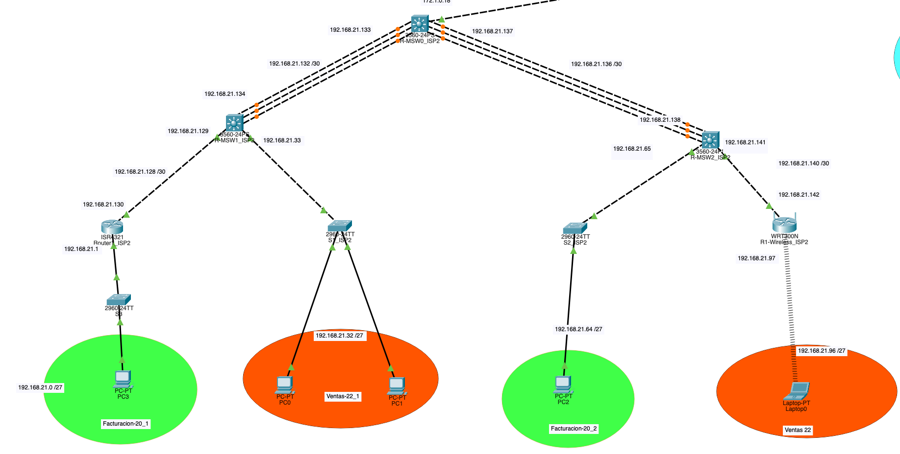

# Documentación Proyecto 2 - Redes 2

## Descripcion del Proyecto

---

El crecimiento acelerado de la población y la alta demanda de servicios de telecomunicaciones en el país han evidenciado la necesidad de modernizar y ampliar la infraestructura de red nacional. En respuesta a este reto, el gobierno ha convocado a tres de las principales empresas proveedoras de servicios de Internet (ISP): Telecom Uno, Redes Nacionales y Conexiones Futuras, para colaborar en el diseño e implementación de una solución tecnológica que garantice conectividad eficiente, segura y escalable.

Este proyecto forma parte del curso Redes de Computadoras 2 y tiene como objetivo aplicar los conocimientos adquiridos en un entorno práctico que simule una situación real. A través de este ejercicio, se desarrollarán redes internas optimizadas para cada ISP y se establecerán vínculos de comunicación entre ellas utilizando protocolos de enrutamiento dinámico como EIGRP, OSPF y BGP.

Cada red ha sido diseñada con criterios técnicos específicos: topologías adecuadas, enlaces redundantes con LACP, asignación automática de direcciones mediante DHCP, servicios de red como DNS y HTTP, e incorporación de redes inalámbricas. Además, se requiere la creación de una página web que represente al grupo, disponible mediante un dominio DNS configurado como parte del sistema.

El presente documento describe la arquitectura propuesta, el direccionamiento, las configuraciones realizadas y las tecnologías empleadas, con el fin de demostrar la viabilidad de la solución planteada y su contribución al desarrollo de una infraestructura de telecomunicaciones moderna para el país.

## Objetivos
---

El propósito de este proyecto es diseñar, configurar y simular una solución de red integral para un país con creciente demanda en servicios de telecomunicaciones. Con la colaboración de tres proveedores ISP —Telecom Uno, Redes Nacionales y Conexiones Futuras— se busca lograr una infraestructura moderna, escalable y segura. 

**Los objetivos `específicos` son**:

1. **Configurar switches de capa 2 y 3**:
Realizar la configuración adecuada para el funcionamiento eficiente de las redes internas de cada ISP, implementando tanto switches de acceso como de distribución según corresponda.

2. **Aplicar protocolos de enrutamiento dinámico (RIP, OSPF, EIGRP, BGP)**:
Utilizar distintos protocolos de enrutamiento, dependiendo de cada ISP, para garantizar conectividad tanto interna como entre los proveedores.

3. **Implementar enlaces redundantes mediante LACP**:
Utilizar EtherChannel con el protocolo LACP para lograr enlaces agregados que permitan mayor disponibilidad y balanceo de carga en cada topología.

4. **Administrar direccionamiento IP mediante DHCP**:
Configurar servidores DHCP para asignar direcciones IP dinámicas a los dispositivos finales dentro de la red.

5. **Diseñar una solución de conectividad eficiente y segura entre los tres ISP**:
Utilizar BGP para la interconexión de los proveedores, garantizando rutas claras y tráfico fluido entre las diferentes redes.

6. **Incorporar redes inalámbricas**:
Integrar al menos un punto de acceso WiFi en Redes Nacionales para proporcionar conectividad inalámbrica a los usuarios finales.

7. **Implementar un servidor DNS y HTTP funcional**:
Configurar un servidor que proporcione resolución de nombres (DNS) y albergue una página web estática accesible mediante un dominio personalizado.

8. **Documentar y justificar la solución propuesta**:
Elaborar una presentación ejecutiva que justifique la arquitectura seleccionada, costos, tecnologías empleadas y beneficios esperados, orientada a la toma de decisiones gubernamentales.

## Topologia Propuesta


## Objetivo del Diseño de ISP 1
---
La empresa Telecom Uno ha sido seleccionada como uno de los tres proveedores clave en el proyecto nacional de modernización de redes. Su propósito principal dentro de esta iniciativa es establecer una infraestructura de red confiable que sirva como punto de distribución de direcciones IP para toda la topología mediante el uso de DHCP.

Además, Telecom Uno debe garantizar la conectividad eficiente entre sus dos departamentos principales —Administración y Atención al Cliente— aplicando una arquitectura Hub and Spoke, ideal para centralizar el tráfico y simplificar la administración. Esta red interna debe contar con enlaces redundantes a través de LACP, cinco routers, cinco hosts y estar enrutada usando el protocolo EIGRP.

El diseño de esta red debe ser escalable, permitiendo futuras expansiones, y servir como una base sólida para la integración con los demás ISP por medio del protocolo BGP. En conjunto, Telecom Uno actúa como el núcleo de asignación dinámica de IPs, fortaleciendo la administración eficiente del direccionamiento en toda la solución nacional propuesta.


## Configuracion ISP-1

## Configuracion ISP 1

### Subneteo

| #   | Hosts | Subred            | Máscara         | Primer Host      | Último Host       | Broadcast         |
|-----|-------|-------------------|-----------------|------------------|-------------------|-------------------|
| 1   | 30    | 192.168.11.0 /27  | 255.255.255.224 | 192.168.11.1     | 192.168.11.30    | 192.168.11.31     |
| 2   | 30    | 192.168.11.32 /27 | 255.255.255.224 | 192.168.11.33    | 192.168.11.62    | 192.168.11.63     |
| 3   | 30    | 192.168.11.64 /27 | 255.255.255.224 | 192.168.11.65    | 192.168.11.94    | 192.168.11.95     |
| 4   | 30    | 192.168.11.96 /27 | 255.255.255.224 | 192.168.11.97    | 192.168.11.126   | 192.168.11.127    |
| 5   | 2     | 192.168.11.128/30 | 255.255.255.252 | 192.168.11.129   | 192.168.11.130   | 192.168.11.131    |
| 6   | 2     | 192.168.11.132/30 | 255.255.255.252 | 192.168.11.133   | 192.168.11.134   | 192.168.11.135    |
| 7   | 2     | 192.168.11.136/30 | 255.255.255.252 | 192.168.11.137   | 192.168.11.138   | 192.168.11.139    |
| 8   | 2     | 192.168.11.140/30 | 255.255.255.252 | 192.168.11.141   | 192.168.11.142   | 192.168.11.143    |

### Switch1_ISP1
```
enable
configure terminal

!vlans
vlan 10
name Administracion

!trunk
interface fa0/1
switchport mode trunk
switchport trunk allowed vlan all
exit

!access
interface range Fa0/2-3
switchport mode access
switchport access vlan 10
exit

! spanning-tree
spanning-tree mode rapid-pvst 

end
wr

```

### Switch2_ISP1
```
enable
configure terminal

!vlans
vlan 15
name Atencion_al_cliente

!trunk
interface fa0/1
switchport mode trunk
switchport trunk allowed vlan all
exit

!access
interface Fa0/2
switchport mode access
switchport access vlan 15
exit

! spanning-tree
spanning-tree mode rapid-pvst 

end
wr

```

### Switch3_ISP1
```
enable
configure terminal

!vlans
vlan 11
name Server_DCHP

!trunk
interface fa0/1
switchport mode access
switchport access vlan 11
exit

!access
interface Fa0/2
switchport mode access
switchport access vlan 11
exit

! spanning-tree
spanning-tree mode rapid-pvst 

end
wr

```

### Switch4_ISP1
```
enable
configure terminal

!vlans
vlan 15
name Atencion_al_cliente

!trunk
interface fa0/1
switchport mode access
switchport access vlan 15
exit

!access
interface range Fa0/2-3
switchport mode access
switchport access vlan 15
exit

! spanning-tree
spanning-tree mode rapid-pvst 

end
wr

```

### R-MSW0_ISP1
````
enable
configure terminal
ip routing

interface range Fa0/1-3
channel-protocol lacp
channel-group 1 mode passive
no switchport
no shutdown
exit

interface range Fa0/4-6
channel-protocol lacp
channel-group 2 mode passive
no switchport
no shutdown
exit

interface port-channel 1
ip address 192.168.11.129 255.255.255.252
exit

interface port-channel 2
ip address 192.168.11.137 255.255.255.252
exit

interface Fa0/7
no switchport
ip address 192.168.11.133 255.255.255.252
no shutdown
exit

interface Fa0/8
no switchport
ip address 192.168.11.141 255.255.255.252
no shutdown
exit

interface Fa0/9
no switchport
ip address 172.1.0.14 255.255.255.252
no shutdown
exit

router eigrp 100
network 192.168.11.128 0.0.0.3
network 192.168.11.132 0.0.0.3
network 192.168.11.136 0.0.0.3
network 192.168.11.140 0.0.0.3
network 172.1.0.12 0.0.0.3
no auto-summary
exit

end
wr

````


### R-MSW1_ISP1
````
enable
configure terminal
ip routing

interface range Fa0/1-3
channel-protocol lacp
channel-group 1 mode active
no switchport
no shutdown
exit

interface port-channel 1
ip address 192.168.11.130 255.255.255.252
exit


!vlan
vlan 10
name Administracion

interface vlan 10
ip address 192.168.11.33 255.255.255.224
exit


router eigrp 100
network 192.168.11.32 0.0.0.31
network 192.168.11.128 0.0.0.3
no auto-summary
exit

end
wr

````

### R-MSW2_ISP1
````
enable
configure terminal
ip routing

interface range Fa0/4-6
channel-protocol lacp
channel-group 1 mode active
no switchport
no shutdown
exit

interface port-channel 1
ip address 192.168.11.138 255.255.255.252
exit

!vlan
vlan 15
name Atencion_al_cliente

interface vlan 15
ip address 192.168.11.65 255.255.255.224
exit


router eigrp 100
network 192.168.11.64 0.0.0.31
network 192.168.11.136 0.0.0.3
no auto-summary
exit

end
wr

````

### Router1_ISP1

```
enable
configure terminal

interface GigabitEthernet0/0
ip address 192.168.11.142 255.255.255.252
no shutdown
exit

interface GigabitEthernet0/1
ip address 192.168.11.97 255.255.255.224
no shutdown
exit

!EIGRP
router eigrp 100
network 192.168.11.96 0.0.0.31
network 192.168.11.140 0.0.0.3
no auto-summary
exit

end
wr

show standby brief

```
### Router2_ISP1

```
enable
configure terminal

interface GigabitEthernet0/0
ip address 192.168.11.134 255.255.255.252
no shutdown
exit

interface GigabitEthernet0/1
ip address 192.168.11.1 255.255.255.224
no shutdown
exit

!EIGRP
router eigrp 100
network 192.168.11.0 0.0.0.31
network 192.168.11.132 0.0.0.3
no auto-summary
exit

end
wr

show standby brief

```


## Configuración BGP

### Subneteo de red 172.1.0.0 /16

|   Name | Network Address   | Mask            | Usable Range            | Broadcast   |
|-------:|:------------------|:----------------|:------------------------|:------------|
|      1 | 172.1.0.0 /30     | 255.255.255.252 | 172.1.0.1 - 172.1.0.2   | 172.1.0.3   |
|      2 | 172.1.0.4 /30     | 255.255.255.252 | 172.1.0.5 - 172.1.0.6   | 172.1.0.7   |
|      3 | 172.1.0.8 /30     | 255.255.255.252 | 172.1.0.9 - 172.1.0.10  | 172.1.0.11  |
|      4 | 172.1.0.12 /30    | 255.255.255.252 | 172.1.0.13 - 172.1.0.14 | 172.1.0.15  |
|      5 | 172.1.0.16 /30    | 255.255.255.252 | 172.1.0.17 - 172.1.0.18 | 172.1.0.19  |
|      6 | 172.1.0.20 /30   | 255.255.255.252 | 172.1.0.21 - 172.1.0.22 | 172.1.0.23  |


### RR1
```
enable
configure terminal
ip routing

interface GigabitEthernet1/1/3
no switchport
ip address 172.1.0.1 255.255.255.252
no shutdown
exit

interface GigabitEthernet1/1/4
no switchport
ip address 172.1.0.9 255.255.255.252
no shutdown
exit

interface GigabitEthernet1/0/1
no switchport
ip address 172.1.0.13 255.255.255.252
no shutdown
exit

router bgp 65001
neighbor 172.1.0.10 remote-as 65002
neighbor 172.1.0.3 remote-as 65003
network 172.1.0.0 mask 255.255.255.252
network 172.1.0.8 mask 255.255.255.252
network 172.1.0.12 mask 255.255.255.252
redistribute eigrp 100
exit

router eigrp 100
redistribute bgp 65001 metric 100000 100 255 1 1500
network 172.1.0.12 0.0.0.3
no auto-summary
exit

end
wr

```

### RR2
```
enable
configure terminal
ip routing

interface GigabitEthernet1/1/3
no switchport
ip address 172.1.0.10 255.255.255.252
no shutdown
exit

interface GigabitEthernet1/1/4
no switchport
ip address 172.1.0.5 255.255.255.252
no shutdown
exit

interface GigabitEthernet1/0/1
no switchport
ip address 172.1.0.17 255.255.255.252
no shutdown
exit

router bgp 65002
neighbor 172.1.0.9 remote-as 65001
neighbor 172.1.0.6 remote-as 65003
network 172.1.0.4 mask 255.255.255.252
network 172.1.0.8 mask 255.255.255.252
network 172.1.0.16 mask 255.255.255.252
redistribute eigrp 10
exit

router eigrp 10
redistribute bgp 65002 metric 100000 100 255 1 1500
network 172.1.0.16 0.0.0.3
no auto-summary
exit

end
wr
```
### RR3
```
enable
configure terminal
ip routing

interface GigabitEthernet1/1/3
no switchport
ip address 172.1.0.2 255.255.255.252
no shutdown
exit

interface GigabitEthernet1/1/4
no switchport
ip address 172.1.0.6 255.255.255.252
no shutdown
exit

interface GigabitEthernet1/0/1
no switchport
ip address 172.1.0.21 255.255.255.252
no shutdown
exit

router bgp 65003
neighbor 172.1.0.1 remote-as 65001
neighbor 172.1.0.5 remote-as 65002
network 172.1.0.0 mask 255.255.255.252
network 172.1.0.4 mask 255.255.255.252
network 172.1.0.20 mask 255.255.255.252
redistribute ospf 1
exit

router ospf 1
redistribute bgp 65003 subnets
network 172.1.0.20 0.0.0.3 area 1
exit

end
wr
```


## Server DHCP

#### IP
```
192.168.11.2
```


### Pools


### R-MSW1_ISP1
```
! Helper Address
enable
configure terminal

interface vlan 10
ip helper-address 192.168.11.2
exit

end
wr

```

### R-MSW2_ISP1
```
! Helper Address
enable
configure terminal

interface vlan 15
ip helper-address 192.168.11.2
exit

end
wr

```

### Router1_ISP1
```
! Helper Address
enable
configure terminal

interface GigabitEthernet0/1
ip helper-address 192.168.11.2
exit

end
wr

```

### Router1_ISP2
```
! Helper Address
enable
configure terminal

interface GigabitEthernet0/0/0
ip helper-address 192.168.11.2
exit

end
wr

```
### R-MSW1_ISP2
```
! Helper Address
enable
configure terminal

interface Fa0/1
ip helper-address 192.168.11.2
exit

end
wr

```

### R-MSW2_ISP2
```
! Helper Address
enable
configure terminal

interface Fa0/1
ip helper-address 192.168.11.2
exit

end
wr

```


### Router1_ISP3
```
! Helper Address
enable
configure terminal
interface GigabitEthernet0/1.30
ip helper-address 192.168.11.2
exit
interface GigabitEthernet0/1.35
ip helper-address 192.168.11.2
exit
end
wr

```

### Router2_ISP3
```
! Helper Address
enable
configure terminal
interface GigabitEthernet0/1.30
ip helper-address 192.168.11.2
exit
interface GigabitEthernet0/1.35
ip helper-address 192.168.11.2
exit
end
wr

```


### PC's


## ACL

### R-MSW1_ISP1
```
enable
configure terminal

! Administracion-10
no access-list 100
access-list 100 permit ip any any

interface Vlan10
ip access-group 100 in
exit

end
wr

```

### R-MSW2_ISP1
```
enable
configure terminal

! Atencion_al_cliente-15_2
no access-list 100
!isp1
access-list 100 permit icmp 192.168.11.64 0.0.0.31 192.168.11.32 0.0.0.31 echo-reply
access-list 100 deny ip 192.168.11.64 0.0.0.31 192.168.11.32 0.0.0.31
!isp2
access-list 100 deny ip 192.168.11.64 0.0.0.31 192.168.21.0 0.0.0.31
access-list 100 deny ip 192.168.11.64 0.0.0.31 192.168.21.64 0.0.0.31
!isp3

access-list 100 permit ip any any


interface vlan 15
ip access-group 100 in
exit

end
wr

```

### Router1_ISP1
```
enable
configure terminal

! Atencion_al_cliente-15_1
no access-list 100
!isp1
access-list 100 permit icmp 192.168.11.96 0.0.0.31 192.168.11.32 0.0.0.31 echo-reply
access-list 100 deny ip 192.168.11.96 0.0.0.31 192.168.11.32 0.0.0.31
!isp2
access-list 100 deny ip 192.168.11.96 0.0.0.31 192.168.21.0 0.0.0.31
access-list 100 deny ip 192.168.11.96 0.0.0.31 192.168.21.64 0.0.0.31
!isp3

access-list 100 permit ip any any

interface GigabitEthernet0/1
ip access-group 100 in
exit

end
wr

```


### Router1_ISP2
```
enable
configure terminal

! Facturacion-20_1
!isp1
no access-list 100
access-list 100 permit icmp 192.168.21.0 0.0.0.31 192.168.11.32 0.0.0.31 echo-reply
access-list 100 deny ip 192.168.21.0 0.0.0.31 192.168.11.32 0.0.0.31
access-list 100 deny ip 192.168.21.0 0.0.0.31 192.168.11.64 0.0.0.31
access-list 100 deny ip 192.168.21.0 0.0.0.31 192.168.11.96 0.0.0.31
!isp2
!isp3


access-list 100 permit ip any any


interface GigabitEthernet0/0/0
ip access-group 100 in
exit

end
wr

```

### R-MSW1_ISP2
```
enable
configure terminal

! Ventas-22_1
no access-list 100
!isp1
access-list 100 permit icmp 192.168.21.32 0.0.0.31 192.168.11.32 0.0.0.31 echo-reply
access-list 100 deny ip 192.168.21.32 0.0.0.31 192.168.11.32 0.0.0.31
!isp2
!isp3

access-list 100 permit ip any any

interface fa0/1
ip access-group 100 in
exit

end
wr

```

### R-MSW2_ISP2
```
enable
configure terminal

! Facturacion-20_2
no access-list 100
!isp1
access-list 100 permit icmp 192.168.21.64 0.0.0.31 192.168.11.32 0.0.0.31 echo-reply
access-list 100 deny ip 192.168.21.64 0.0.0.31 192.168.11.32 0.0.0.31
access-list 100 deny ip 192.168.21.64 0.0.0.31 192.168.11.64 0.0.0.31
access-list 100 deny ip 192.168.21.64 0.0.0.31 192.168.11.96 0.0.0.31
!isp2
!isp3

access-list 100 permit ip any any

interface fa0/1
ip access-group 100 in
exit

end
wr

```


### Router1_ISP3
```
enable
configure terminal

! Soporte-30
no access-list 100

access-list 100 permit ip 192.168.31.32 0.0.0.31 192.168.11.96 0.0.0.31
access-list 100 permit ip 192.168.31.32 0.0.0.31 192.168.11.64 0.0.0.31
access-list 100 permit ip 192.168.31.32 0.0.0.31 192.168.21.0 0.0.0.31
access-list 100 permit ip 192.168.31.32 0.0.0.31 192.168.21.32 0.0.0.31
access-list 100 permit ip 192.168.31.32 0.0.0.31 192.168.21.64 0.0.0.31
access-list 100 permit ip 192.168.31.32 0.0.0.31 192.168.21.96 0.0.0.31
access-list 100 permit ip 192.168.31.32 0.0.0.31 192.168.31.64 0.0.0.31
access-list 100 permit icmp 192.168.31.32 0.0.0.31 192.168.11.32 0.0.0.31 echo-reply
access-list 100 deny ip 192.168.31.32 0.0.0.31 192.168.11.32 0.0.0.31
access-list 100 permit ip any any
p

interface GigabitEthernet0/1.30
ip access-group 100 in
exit

! Seguridad-35
no access-list 101
access-list 101 permit ip 192.168.31.64 0.0.0.31 192.168.11.96 0.0.0.31
access-list 101 permit ip 192.168.31.64 0.0.0.31 192.168.11.64 0.0.0.31
access-list 101 permit ip 192.168.31.64 0.0.0.31 192.168.21.0 0.0.0.31
access-list 101 permit ip 192.168.31.64 0.0.0.31 192.168.21.32 0.0.0.31
access-list 101 permit ip 192.168.31.64 0.0.0.31 192.168.21.64 0.0.0.31
access-list 101 permit ip 192.168.31.64 0.0.0.31 192.168.21.96 0.0.0.31
access-list 101 permit ip 192.168.31.64 0.0.0.31 192.168.31.32 0.0.0.31
access-list 101 permit icmp 192.168.31.64 0.0.0.31 192.168.11.32 0.0.0.31 echo-reply
access-list 101 deny ip 192.168.31.64 0.0.0.31 192.168.11.32 0.0.0.31
access-list 101 permit ip any any


interface GigabitEthernet0/1.35
ip access-group 101 in
exit


end
wr

```

### Router2_ISP3
```
enable
configure terminal

! Soporte-30
no access-list 100

access-list 100 permit ip 192.168.31.32 0.0.0.31 192.168.11.96 0.0.0.31
access-list 100 permit ip 192.168.31.32 0.0.0.31 192.168.11.64 0.0.0.31
access-list 100 permit ip 192.168.31.32 0.0.0.31 192.168.21.0 0.0.0.31
access-list 100 permit ip 192.168.31.32 0.0.0.31 192.168.21.32 0.0.0.31
access-list 100 permit ip 192.168.31.32 0.0.0.31 192.168.21.64 0.0.0.31
access-list 100 permit ip 192.168.31.32 0.0.0.31 192.168.21.96 0.0.0.31
access-list 100 permit ip 192.168.31.32 0.0.0.31 192.168.31.64 0.0.0.31
access-list 100 permit icmp 192.168.31.32 0.0.0.31 192.168.11.32 0.0.0.31 echo-reply
access-list 100 deny ip 192.168.31.32 0.0.0.31 192.168.11.32 0.0.0.31
access-list 100 permit ip any any


interface GigabitEthernet0/1.30
ip access-group 100 in
exit

! Seguridad-35
no access-list 101
access-list 101 permit ip 192.168.31.64 0.0.0.31 192.168.11.96 0.0.0.31
access-list 101 permit ip 192.168.31.64 0.0.0.31 192.168.11.64 0.0.0.31
access-list 101 permit ip 192.168.31.64 0.0.0.31 192.168.21.0 0.0.0.31
access-list 101 permit ip 192.168.31.64 0.0.0.31 192.168.21.32 0.0.0.31
access-list 101 permit ip 192.168.31.64 0.0.0.31 192.168.21.64 0.0.0.31
access-list 101 permit ip 192.168.31.64 0.0.0.31 192.168.21.96 0.0.0.31
access-list 101 permit ip 192.168.31.64 0.0.0.31 192.168.31.32 0.0.0.31
access-list 101 permit icmp 192.168.31.64 0.0.0.31 192.168.11.32 0.0.0.31 echo-reply
access-list 101 deny ip 192.168.31.64 0.0.0.31 192.168.11.32 0.0.0.31
access-list 101 permit ip any any


interface GigabitEthernet0/1.35
ip access-group 101 in
exit


```

## Objetivo del Diseño de ISP 2
---
El propósito de la implementación para ISP 2 es diseñar una red jerárquica eficiente y segmentada, capaz de conectar múltiples áreas funcionales mediante el uso de VLANs, subredes optimizadas y protocolos de enrutamiento dinámico. Esta red debe permitir la comunicación segura y eficiente entre departamentos como Facturación y Ventas, utilizando infraestructura física robusta con redundancia (mediante LACP) y escalabilidad.

La red está compuesta por routers, switches de acceso y multilayer, enlaces punto a punto para interconexión entre dispositivos de capa 3, y segmentación por VLAN para asegurar control de tráfico y seguridad lógica. El protocolo EIGRP se utilizó para facilitar la propagación dinámica de rutas, lo cual asegura que cualquier cambio en la red sea rápidamente adaptado sin necesidad de modificar rutas estáticas.

En resumen, ISP 2 busca proporcionar una red funcional, escalable y administrable que permita el crecimiento y la integración eficiente de servicios de datos internos y externos.




## Configuración ISP-2

### Implementación de Red Segmentada con VLANs y Enrutamiento EIGRP


| Name | Hosts Needed | Hosts Available | Unused Hosts | Network Address   | Slash | Mask              | Usable Range                     | Broadcast         |
|------|---------------|------------------|---------------|--------------------|--------|--------------------|----------------------------------|-------------------|
| 5    | 30            | 30               | 0             | 192.168.21.0       | /27    | 255.255.255.224    | 192.168.21.1 - 192.168.21.30     | 192.168.21.31     |
| 6    | 30            | 30               | 0             | 192.168.21.32      | /27    | 255.255.255.224    | 192.168.21.33 - 192.168.21.62    | 192.168.21.63     |
| 7    | 30            | 30               | 0             | 192.168.21.64      | /27    | 255.255.255.224    | 192.168.21.65 - 192.168.21.94    | 192.168.21.95     |
| 8    | 30            | 30               | 0             | 192.168.21.96      | /27    | 255.255.255.224    | 192.168.21.97 - 192.168.21.126   | 192.168.21.127    |
| 1    | 2             | 2                | 0             | 192.168.21.128     | /30    | 255.255.255.252    | 192.168.21.129 - 192.168.21.130  | 192.168.21.131    |
| 2    | 2             | 2                | 0             | 192.168.21.132     | /30    | 255.255.255.252    | 192.168.21.133 - 192.168.21.134  | 192.168.21.135    |
| 3    | 2             | 2                | 0             | 192.168.21.136     | /30    | 255.255.255.252    | 192.168.21.137 - 192.168.21.138  | 192.168.21.139    |
| 4    | 2             | 2                | 0             | 192.168.21.140     | /30    | 255.255.255.252    | 192.168.21.141 - 192.168.21.142  | 192.168.21.143    |


### R-MSW0_ISP2

```
enable
configure terminal

interface Fa0/1
no switchport
ip address 172.1.0.18 255.255.255.252
no shutdown
exit

router eigrp 10
network 192.168.21.64 0.0.0.31
network 192.168.21.132 0.0.0.3
network 192.168.21.136 0.0.0.3
network 172.1.0.16 0.0.0.3
no auto-summary
exit

end
wr
```

```

router eigrp 10
no network 192.168.21.0
network 192.168.21.136 0.0.0.3
network 192.168.21.140 0.0.0.3
no auto-summary
exit


router eigrp 10
no network 192.168.21.0
network 192.168.21.32 0.0.0.31
network 192.168.21.128 0.0.0.3
network 192.168.21.132 0.0.0.3
no auto-summary
exit


router eigrp 10
no network 192.168.21.0
network 192.168.21.128 0.0.0.3
network 192.168.21.0 0.0.0.31
no auto-summary
exit

```

### Tecnologías Implementadas

- **VLANs:**  
  - VLAN 20: Facturación  
  - VLAN 22: Ventas  
  - Se configuraron en switches de acceso con puertos en modo access.

  - **EIGRP:**  
  - Protocolo de enrutamiento interno implementado en todos los dispositivos de capa 3.  
  - Permite el intercambio automático de rutas entre redes.

  ### Consideraciones

- Se evitó el uso de trunk entre router y switch ya que se manejó una sola VLAN por enlace.
- Se usaron enlaces punto a punto para conectar routers y switches mediante subredes /30.
- Se establecieron gateways correctos en dispositivos finales para permitir comunicación inter-VLAN.


## Objetivo del diseño de la ISP 3

La empresa Conexiones Futuras desempeña un papel estratégico dentro del proyecto nacional de redes, al ser la encargada de proporcionar servicios críticos de infraestructura a nivel general. Su propósito principal es ofrecer redundancia de capa 3 mediante HSRP, asegurando alta disponibilidad y continuidad del servicio ante posibles fallos en los enlaces o dispositivos principales.

Además, Conexiones Futuras actúa como el proveedor oficial de los servicios de DNS y HTTP, permitiendo que todos los dispositivos dentro de la topología accedan a recursos web y resolución de nombres, incluyendo el dominio oficial del proyecto: www.Proyecto2_GrupoX.com.

Internamente, la red de esta empresa debe estar organizada bajo una topología jerárquica, estructurada en tres capas (acceso, distribución y núcleo) para facilitar la escalabilidad, control de tráfico y segmentación. Debe contar con cinco routers, cinco hosts, dos enlaces LACP y conectar adecuadamente sus dos departamentos: Soporte y Seguridad, mediante procesos de subneteo eficiente y configuración del protocolo de enrutamiento OSPF.

En resumen, Conexiones Futuras aporta resiliencia, servicios esenciales de red y una arquitectura avanzada que refuerza la estabilidad y funcionalidad integral de toda la infraestructura nacional propuesta.


## Configuración ISP-3

Subredes

| #   | Hosts | Subred           | Máscara         | Primer Host     | Último Host      | Broadcast        |
|-----|-------|------------------|-----------------|-----------------|-----------------|------------------|
| 1   | 30    | 192.168.31.0 /27 | 255.255.255.224 | 192.168.31.1    | 192.168.31.30   | 192.168.31.31    |
| 2   | 30    | 192.168.31.32 /27 | 255.255.255.224 | 192.168.31.33   | 192.168.31.62   | 192.168.31.63    |
| 3   | 30    | 192.168.31.64 /27 | 255.255.255.224 | 192.168.31.65   | 192.168.31.94   | 192.168.31.95    |
| 4   | 2     | 192.168.31.96 /30 | 255.255.255.252 | 192.168.31.97   | 192.168.31.98   | 192.168.31.99    |
| 5   | 2     | 192.168.31.100/30 | 255.255.255.252 | 192.168.31.101  | 192.168.31.102  | 192.168.31.103   |
| 6   | 2     | 192.168.31.104/30 | 255.255.255.252 | 192.168.31.105  | 192.168.31.106  | 192.168.31.107   |
| 7   | 2     | 192.168.31.108/30 | 255.255.255.252 | 192.168.31.109  | 192.168.31.110  | 192.168.31.111   |
| 8   | 2     | 192.168.31.112/30 | 255.255.255.252 | 192.168.31.113  | 192.168.31.114  | 192.168.31.115   |

### VTP y VLANS

### Switch0_ISP3
```
enable
configure terminal

! vtp server
vtp version 2
vtp domain g37_isp3
vtp mode server
vtp password g37_isp3

!vlans
vlan 30
name Soporte
vlan 35
name Seguridad

!trunk
interface range fa0/1-4
switchport mode trunk
switchport trunk allowed vlan all
exit

! spanning-tree
spanning-tree mode rapid-pvst 

end
wr

```

### Switch1_ISP3
```
enable
configure terminal
vtp version 2
vtp domain g37_isp3
vtp mode client
vtp password g37_isp3

!trunk
interface range fa0/1-2
switchport mode trunk
switchport trunk allowed vlan all
exit

!access
interface range Fa0/3-5
switchport mode access
switchport access vlan 30
exit

! spanning-tree
spanning-tree mode rapid-pvst 

end
wr
```

### Switch2_ISP3
```
enable
configure terminal
vtp version 2
vtp domain g37_isp3
vtp mode client
vtp password g37_isp3

!trunk
interface range fa0/1-2
switchport mode trunk
switchport trunk allowed vlan all
exit

!access
interface range Fa0/3-4
switchport mode access
switchport access vlan 35
exit

! spanning-tree
spanning-tree mode rapid-pvst

end
wr
```

### Switch4_ISP3
```
enable
configure terminal

!vlans
vlan 31
name Server_DNS

!trunk
interface fa0/1
switchport mode trunk
switchport trunk allowed vlan all
exit

!access
interface Fa0/3
switchport mode access
switchport access vlan 31
exit

! spanning-tree
spanning-tree mode rapid-pvst 

end
wr

```


### Router1_ISP3

```
enable
configure terminal

interface GigabitEthernet0/0
ip address 192.168.31.109 255.255.255.252
no shutdown
exit

interface GigabitEthernet0/1
no shutdown
exit

! Configuración para la VLAN Soporte-30
interface GigabitEthernet0/1.30
encapsulation dot1Q 30
ip address 192.168.31.33 255.255.255.224
standby 30 ip 192.168.31.35
standby 30 priority 110
standby 30 preempt
exit

! Configuración para la VLAN Seguridad-35
interface GigabitEthernet0/1.35
encapsulation dot1Q 35
ip address 192.168.31.65 255.255.255.224
standby 35 ip 192.168.31.67
standby 35 priority 90
standby 35 preempt
exit

!ospf
router ospf 1
network 192.168.31.32 0.0.0.31 area 1
network 192.168.31.64 0.0.0.31 area 1
network 192.168.31.108 0.0.0.3 area 1

end
wr

show standby brief

```
### Router2_ISP3

```
enable
configure terminal

interface GigabitEthernet0/0
ip address 192.168.31.113 255.255.255.252
no shutdown
exit

interface GigabitEthernet0/1
no shutdown
exit

! Configuración para la VLAN Soporte-30
interface GigabitEthernet0/1.30
encapsulation dot1Q 30
ip address 192.168.31.34 255.255.255.224
standby 30 ip 192.168.31.35
standby 30 priority 90
standby 30 preempt
exit

! Configuración para la VLAN Seguridad-35
interface GigabitEthernet0/1.35
encapsulation dot1Q 35
ip address 192.168.31.66 255.255.255.224
standby 35 ip 192.168.31.67
standby 35 priority 110
standby 35 preempt
exit

!ospf
router ospf 1
network 192.168.31.32 0.0.0.31 area 1
network 192.168.31.64 0.0.0.31 area 1
network 192.168.31.112 0.0.0.3 area 1

end
wr

show standby brief

```


### R-MSW2_ISP3
````
enable
configure terminal
ip routing

interface range Fa0/1-3
channel-protocol lacp
channel-group 1 mode active
no switchport
no shutdown
exit

interface port-channel 1
no switchport
ip address 192.168.31.101 255.255.255.252
exit

interface GigabitEthernet0/1
no switchport
ip address 192.168.31.105 255.255.255.252
no shutdown
exit

interface Fa0/4
no switchport
ip address 192.168.31.110 255.255.255.252
no shutdown
exit

interface Fa0/5
no switchport
ip address 192.168.31.114 255.255.255.252
no shutdown
exit

router ospf 1
network 192.168.31.100 0.0.0.3 area 1
network 192.168.31.104 0.0.0.3 area 1
network 192.168.31.108 0.0.0.3 area 1
network 192.168.31.112 0.0.0.3 area 1

end
wr

````


### R-MSW1_ISP3
````
enable
configure terminal
ip routing

interface range Fa0/4-6
channel-protocol lacp
channel-group 1 mode active
no shutdown
exit

interface port-channel 1
no switchport
ip address 192.168.31.97 255.255.255.252
exit

interface GigabitEthernet0/1
no switchport
ip address 192.168.31.106 255.255.255.252
no shutdown
exit


!vlan
vlan 31
name Server_DNS

interface vlan 31
ip address 192.168.31.1 255.255.255.252
exit

router ospf 1
network 192.168.31.96 0.0.0.3 area 1
network 192.168.31.104 0.0.0.3 area 1
network 192.168.31.0 0.0.0.31 area 1
end
wr

````


### R-MSW0_ISP3
````
enable
configure terminal
ip routing

interface range Fa0/1-3
channel-protocol lacp
channel-group 1 mode passive
no switchport
no shutdown
exit

interface range Fa0/4-6
channel-protocol lacp
channel-group 2 mode passive
no switchport
no shutdown
exit

interface port-channel 1
no switchport
ip address 192.168.31.102 255.255.255.252
exit

interface port-channel 2
no switchport
ip address 192.168.31.98 255.255.255.252
exit

interface Fa0/7
no switchport
ip address 172.1.0.22 255.255.255.252
no shutdown
exit

router ospf 1
network 192.168.31.96 0.0.0.3 area 1
network 192.168.31.100 0.0.0.3 area 1
network 172.1.0.20 0.0.0.3 area 1
exit

end
wr

````


## Configuracion DNS_ISP3
---

1. ***Asignar direccion IP estatica al Servidor***:
    * IP: 192.168.31.2
    * Subnet mask: 255.255.255.224
    * Default Gateway: Dirección IP del router o switch multilayer que conecta al servidor.


2. ***Activar el servicio HTTP***:
    * En services seleccionar HTTP y asegurarse que el servicio esta encendido


3. ***Editar el contenido de la pagina web y darle save***:

```html
<!DOCTYPE html>
<html>
<head>
  <title>Grupo 37</title>
</head>
<body>
  <h1>Bienvenidos al Proyecto 2</h1>
  <p>Integrantes del Grupo 37:</p>
  <ul>
    <li> Alejandro Rene Caballeros Gonzales - 201903549</li>
    <li> Christtopher Jose Chitay Coutino - 201113851</li>
    <li> Raudy David Cabrera Contreras - 201901973</li>
  </ul>
</body>
</html>
```


### Configurar el Servidor DNS (ServerDHCP o ServerDNS)

1. Ir Services > DNS y encender el servicio ON

2. En el campo de configuracion de dominio agregar:
    * Name: www.Proyecto2_Grupo37.com
    * Address: Dirección IP del ServerWeb, por ejemplo 192.168.31.2
    * Presionar Add.


### Actualizar los Pool del Server DHCP en la propiedad DNS

Irse al Servidor DHCP y actuacilar la el dns


### Actualizar DNS de Wirless Router 1


### Actualizar DNS de Wirless Router 0


### Actualizar DNS de todas las PC


### Prueba DNS

Ingresar a PC > Desktop > Web Browser

Y poner esta URL
```
http://www.Proyecto2_Grupo37.com
```
Darle "Go"


## Resumen General de Costos
---

Para la implementación completa del proyecto nacional de interconexión entre los tres proveedores de servicios de internet (ISP), se ha realizado un análisis de costos estimado considerando los dispositivos y componentes esenciales para el funcionamiento óptimo de cada red.

La inversión total se distribuye entre las redes internas de Telecom Uno (ISP 1), Redes Nacionales (ISP 2) y Conexiones Futuras (ISP 3), tomando en cuenta routers, switches, servidores, equipos finales y accesorios básicos. Cada ISP fue diseñado con características específicas según sus responsabilidades dentro de la infraestructura nacional, lo que influye directamente en su estimación de costos.

La inversión total estimada asciende a $31,980 dólares (Q249,444 quetzales), lo cual representa un gasto razonable considerando que la arquitectura propuesta es escalable, robusta, redundante y diseñada para ofrecer servicios esenciales como DHCP, DNS, HTTP y conectividad inalámbrica.

Esta estimación proporciona una base sólida para la toma de decisiones presupuestarias y demuestra que la solución propuesta cumple con los objetivos de eficiencia, cobertura y sostenibilidad.


## Propuesta de Gasto Estimado para la Implementación de ISP 1

| Dispositivo                | Cantidad | Precio Unitario (USD) | Subtotal (USD) | Subtotal (GTQ) |
|----------------------------|----------|------------------------|----------------|----------------|
| Routers ISR 4321          | 4        | $1,000                 | $4,000         | Q31,200        |
| Switches 2960-24TT        | 3        | $400                   | $1,200         | Q9,360         |
| Switches Multilayer 3560  | 3        | $600                   | $1,800         | Q14,040        |
| Servidor DHCP             | 1        | $800                   | $800           | Q6,240         |
| PCs (PC-PT)               | 5        | $500                   | $2,500         | Q19,500        |
| Laptop (Laptop-PT)        | 1        | $600                   | $600           | Q4,680         |
| Cables, racks y extras    | 1        | $500                   | $500           | Q3,900         |

**Total Estimado en USD:** $11,400  
**Total Estimado en GTQ:** Q88,920  


## Propuesta de Gasto Estimado para la Implementación de ISP 2

A continuación se detalla el costo aproximado del equipo necesario para la implementación de la red:

| Dispositivo             | Cantidad | Precio Unitario (USD) | Subtotal (USD) |
|--------------------------|----------|------------------------|----------------|
| Routers ISR 4321         | 3        | $1,000                  | $3,000         |
| Switches 2960-24TT       | 3        | $400                    | $1,200         |
| Switches Multilayer 3560 | 3        | $600                    | $1,800         |
| Access Point WRT300N     | 1        | $80                     | $80            |
| PCs (PC-PT)              | 4        | $500                    | $2,000         |
| Laptop (Laptop-PT)       | 1        | $600                    | $600           |
| Cables, racks y extras   | -        | -                       | $500           |


### Total Estimado: **$9,180 USD**

## Propuesta de Gasto Estimado para la Implementación de ISP 3

| Dispositivo                | Cantidad | Precio Unitario (USD) | Subtotal (USD) | Subtotal (GTQ) |
|----------------------------|----------|------------------------|----------------|----------------|
| Routers 2901              | 4        | $800                   | $3,200         | Q24,960        |
| Switches 2960-24TT        | 3        | $400                   | $1,200         | Q9,360         |
| Switches Multilayer 3560  | 3        | $600                   | $1,800         | Q14,040        |
| Servidor DNS/HTTP         | 1        | $900                   | $900           | Q7,020         |
| PCs (PC-PT)               | 4        | $500                   | $2,000         | Q15,600        |
| Laptops (Laptop-PT)       | 3        | $600                   | $1,800         | Q14,040        |
| Cables, racks y extras    | 1        | $500                   | $500           | Q3,900         |

**Total Estimado en USD:** $11,400  
**Total Estimado en GTQ:** Q88,920  

## Resumen Consolidado de Costos por ISP

| ISP                  | Total en USD | Total en GTQ |
|----------------------|--------------|---------------|
| ISP 1 - Telecom Uno  | $11,400      | Q88,920       |
| ISP 2 - Redes Nacionales | $9,180       | Q71,604       |
| ISP 3 - Conexiones Futuras | $11,400      | Q88,920       |

**Total General en USD:** $31,980  
**Total General en GTQ:** Q249,444  


### Notas:
- Los precios son estimados y pueden variar según el proveedor.
- No se incluyen costos de licencias, servidores adicionales ni servicios de instalación.
- La infraestructura está diseñada para soportar crecimiento futuro con mínima inversión adicional.
